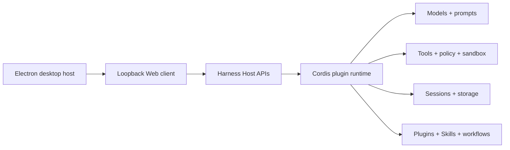

<p align="center">
  
</p>

# Open DeepSeek Harness Desktop

<p align="center">
  <strong>A ready-to-use, dependency-safe desktop edition of DeepSeek Harness</strong>
</p>

Languages: [简体中文](../../README.md) · English · [日本語](README.ja.md) · [한국어](README.ko.md) · [Español](README.es.md) · [Français](README.fr.md) · [Deutsch](README.de.md) · [Português](README.pt-BR.md)

> [!IMPORTANT]
>
> **[v0.1.6-alpha.2 is now available](https://github.com/flaqai/open-deepseek-harness-desktop/releases/tag/odsh-v0.1.6-alpha.2).** This release synchronizes the official [DeepSeek Harness `dsh-v0.1.6-alpha.2`](https://github.com/deepseek-ai/deepseek-harness/releases/tag/dsh-v0.1.6-alpha.2), adding plugin management, end-of-turn file review, Office and Web sidebar previews, Subagent conversations, and plan previews while retaining the community desktop's independent data directories, diagnostic recovery, bundled plugins, and update channels.
>
> Although the version contains `alpha`, the community build is published as a regular GitHub Release. Back up important configuration before upgrading, and include relevant logs or diagnostic reports when reporting problems.

<p align="center">
  <a href="https://github.com/flaqai/open-deepseek-harness-desktop/releases"></a>
  <a href="./LICENSE"></a>
  <a href="https://github.com/deepseek-ai/deepseek-harness"></a>
</p>

Open DeepSeek Harness Desktop is an independent, community-maintained desktop distribution of [DeepSeek Harness](https://github.com/deepseek-ai/deepseek-harness). It combines the upstream plugin-based agent runtime, Web workspace, and native desktop integration into an installable app for configuring models, running coding sessions, inspecting execution, managing plugins and Skills, and connecting external coding tools or IM bots.

Installers include Node.js, pnpm, and the Harness runtime, so users do not need to prepare a development environment. Electron does not become a second agent runtime: configuration, credentials, sessions, plugins, and Skills remain owned by the local Harness service, while Electron exposes only capability-scoped desktop integration.

> [!NOTE]
>
> This repository is not an official DeepSeek product. It is an open-source community project built on DeepSeek Harness and remains in preview; local data formats, plugin compatibility policies, and installation details may continue to evolve.

## Current feature highlights

- [AI conversation workspace](#ai-conversation-workspace): adjustable content, turn navigation, exact token usage, queued messages, and richer image and file handling.
- [First launch and independent data environments](#first-launch-and-independent-data-environments): import an official configuration, share a directory directly, or start fresh.
- [NAS runtime (preview)](#nas-runtime-preview): a community-provided Linux runtime that lets multiple desktop clients use one Profile, conversation store, and Workspace set.
- [Plugin discovery, installation, and updates](#plugin-discovery-installation-and-updates): live market data, categories, local status, direct installation, and online updates.
- [Official 0.1.6 experiments](#official-016-experiments): install Browser Use, Computer Use, and Auto review on demand from Settings.
- [Bundled work runtimes](#bundled-work-runtimes): use bundled or local Python, then enable the Office toolkit or experimental Python PTC separately.
- [Supercharged diagnostics](#supercharged-diagnostics): inspect pnpm, Cordis, and Loader state before startup, then exercise, quarantine, or recover plugins.
- [Customizable Settings navigation](#customizable-settings-navigation): scroll, reorder, and preserve the user's Settings layout.
- [Desktop enhancements](#desktop-enhancements-to-the-upstream-web-experience): native installers, tray operation, quick restart, notifications, logs, updates, and system integration.

## AI conversation workspace

The desktop client includes the complete DeepSeek Harness conversation experience. Completed answers can fold process content and the System Prompt. Conversation width and font size are adjustable, Markdown tables scale with the body text, compact turn navigation and exact token usage make long sessions easier to inspect, and streamed code retains syntax highlighting while it is generated.

Question history uses readable question-and-answer cards with completed, cancelled, and interrupted states. Switching sessions preserves an unsubmitted question card. While a session is still running, users can continue typing; the primary action becomes Send and the new message enters the send queue.

Archiving a session does not delete its contents. Open **Settings → Archived sessions** to search and filter by Workspace, restore one session or restore them all. Restored sessions return to their original Workspace with their message history intact.

Images appear immediately while compression and upload continue in the background. Long screenshots balance size and clarity, image usage participates in context-compaction accounting, and the trace can display images from users, assistants, and tool results. Local-filesystem mode can locate uploaded images, and editing adjacent text does not invalidate file or session references in the composer.

## First launch and independent data environments

At first launch, the client checks the default official DSH data directory at `~/.dsh`. If it is absent or unsupported, users can choose another directory manually or create a clean desktop-owned environment. The chooser provides Chinese and English controls before the main Settings page is available.

### Import into an independent environment

Supported data is copied into a desktop-owned directory while the source remains unchanged. Settings, credentials, sessions, workspace information, Agent presets, Skills, and connection state can be imported.

Profiles, `node_modules`, lockfiles, plugin runtimes, bundled-plugin markers, quarantine and health records, and anonymous identifiers are not copied. Plugin configuration and a restoration list are retained, but plugin packages are installed again into the desktop Profile. After import, later changes in Desktop and the official DSH CLI/Web environment remain independent.

<p align="center">
  
  <br>
  <sub>Import into an independent environment: copy supported data and leave the source unchanged</sub>
</p>

### Reuse a community desktop configuration

The official `~/.dsh` directory can only be imported into an independent environment; it is no longer offered as a shared live directory. Open DeepSeek Harness Desktop writes a product-identity file when it creates or adopts a data directory. A community configuration carrying that identity or a valid legacy desktop record can be reused directly. When recognizable DSH data has neither record, the app asks the user to confirm that it came from an older Open DeepSeek Harness Desktop release before continuing. Malformed or explicitly foreign identity records remain rejected to avoid silently loading an incompatible Profile, plugin set, or desktop state.

After the identity check passes, settings, credentials, sessions, Agent presets, Skills, Profiles, and plugins are shared by Open DeepSeek Harness Desktop instances using that directory.

<p align="center">
  
  <br>
  <sub>Reuse a community desktop configuration after its product identity is verified</sub>
</p>

### Start fresh

Create an empty, desktop-owned data directory without importing existing settings, sessions, or plugins. This is suitable for first-time DSH users and for testing a clean environment.

<p align="center">
  
  <br>
  <sub>Start fresh: do not read or modify an existing DSH configuration</sub>
</p>

### Choose a custom independent data directory

Both **Import into an independent environment** and **Start fresh** offer a choice between the managed default and a custom data directory before continuing. A custom target must be an empty folder and becomes this client's independent data root; the source configuration is not modified or kept in sync. On Windows, sessions, plugin Profiles, and other growing data can live on drive D: or another non-system volume instead of putting continued pressure on drive C:.

<p align="center">
  
  <br>
  <sub>Independent import: choose the managed default or an empty folder before copying data</sub>
</p>

<p align="center">
  
  <br>
  <sub>Start fresh: place the new independent data root in a user-selected location</sub>
</p>

After initial setup, the data directory can still be changed from **Settings → General settings**. Return to the client-managed directory, use the official `~/.dsh`, select another existing DSH directory, or create a new configuration in an empty folder. Switching only selects the directory used after restart; it does not copy, move, merge, or delete data in the original directory. An empty folder starts the first-install flow again after restart.

<p align="center">
  
  <br>
  <sub>Switch safely to an existing configuration or create a new independent configuration in an empty folder</sub>
</p>

After entry, the setup wizard can configure a model API key, connect phone access, set up WeChat or Feishu and other IM bots, and optionally connect Codex. Every task can be skipped and completed later from Settings.

### NAS runtime (preview)

When several computers need the same plugins, model settings, conversation history, and workspaces, run the community-provided Compose deployment on a Linux x64/arm64 NAS and pair it from **Settings → Runtime & NAS**. This is an experimental Open DeepSeek Harness Desktop capability, not an official DeepSeek Harness desktop distribution. The NAS owns `/config` and `/workspaces`; Desktop acts only as its client, never places a local Profile on SMB/NFS, and never silently falls back to the local runtime after a connection failure.

NAS mode shares plugins, model settings, sessions, and Workspaces. Window, theme, notification, and download preferences remain on each computer. Before first use, back up the directories that will be mounted as `/config` and `/workspaces`; do not keep the only copy of important data in this preview capability.

#### Prepare and start the NAS

1. Obtain this repository on a Linux x64/arm64 NAS with Docker Compose, open [`deploy/nas`](../../deploy/nas/README.md), and copy `.env.example` to `.env`.
2. Configure a dedicated root HTTPS hostname such as `harness.local`; v1 does not accept a subpath such as `https://host/path`. Make the hostname resolve to the NAS from every desktop computer.
3. Point `CONFIG_PATH` and `WORKSPACES_PATH` at durable, backed-up NAS directories, then set `PUID` and `PGID` to a user and group that can write both directories. Set `HTTPS_PORT` only when another external HTTPS port is required.
4. Start Compose by following the [NAS deployment guide](../../deploy/nas/README.md). The Harness container does not publish its HTTP port to the LAN; by default, only Caddy HTTPS accepts client connections.
5. Read the eight-digit pairing code from the Harness container log and obtain the site certificate's TLS SHA-256 fingerprint separately from the NAS administration terminal. The code is valid for ten minutes. Ten consecutive incorrect attempts require waiting for the next ten-minute window and reading the new code.

#### Pair and connect Desktop

1. Open **Settings → Runtime & NAS**. Select **Search for NAS on the network**, or enter `https://<NAS_HOSTNAME>` directly. An mDNS result only fills the address and does not establish trust.
2. Enter a recognizable name for the current computer and the eight-digit pairing code, then select **Inspect certificate**.
3. Compare the displayed SHA-256 fingerprint character by character with the value from the NAS administration terminal. Only after an exact match, select the trust confirmation and then **Trust and pair**. Do not establish identity from the LAN discovery result alone.
4. After pairing, select **Test connection** on the saved NAS card. When the connection is healthy, select **Connect and restart**. After Desktop fully restarts, the NAS supplies tasks, plugins, model settings, sessions, and Workspaces.

Each computer receives its own device credential, which is valid for 90 days by default and stored through protected system storage. To stop one computer from connecting, open **Manage devices** on the NAS card from another connected Desktop and revoke that device. Revocation does not delete sessions or Workspaces on the NAS.

#### Return to local, back up, and recover

- **Use local** restarts Desktop with the current computer's data directory. It neither moves nor deletes NAS data. Switch to local before removing the active NAS from this computer's saved list.
- Desktop does not silently fall back to local when the NAS is offline or its certificate changes. Use **Test connection** first. If the fingerprint changes unexpectedly, do not trust it until confirming whether Caddy's `caddy_data` was deleted or the HTTPS proxy was replaced.
- `/config` contains sessions, plugins, and model settings; `/workspaces` contains shared work directories. Back up both before upgrading NAS containers. Desktop files are not migrated automatically and must be copied through an explicit user operation.
- With an existing HTTPS reverse proxy, connect the proxy only to `harness:3080` on the same Docker network. Do not publish port 3080 directly to the LAN. See the [NAS deployment guide](../../deploy/nas/README.md) for complete commands, reverse-proxy guidance, and current limitations.

## Plugin discovery, installation, and updates

**Explore plugins** reads the live Plugin Marketplace catalog instead of a fixed recommendation list. The dialog provides popular and category views with Stars, 30-day downloads, and local installation state. An uninstalled plugin can enter the guarded installation flow directly or open in the complete marketplace; an installed plugin opens in market management.

A successful catalog response is cached for 24 hours, so changing categories does not repeatedly fetch the complete registry, and users can force a refresh at any time. Installed state is fetched separately on every open, so a recent install, removal, or pending-restart state is not replaced by recommendation cache data. Network and registry failures show the actual reason; stale cached recommendations remain available with a clear warning.

Plugins installed from local directories or archives retain verifiable package and source-repository identities when available. This lets the market identify a compatible online source and offer **Restore**, but the local source itself is not updated in place; restore the online version before it can participate in normal update checks. Installation, upgrade, removal, and diagnostics continue through the shared plugin-management flow; a market card is not an arbitrary command input.

## Plugin selection and restoration after import

Importing into an independent environment copies plugin configuration and a restoration list, not the old Profile's `node_modules`. Reusing that dependency tree could carry platform-specific packages, a mismatched pnpm Store, lifecycle-script permissions, or shared Host conflicts into the new environment, so plugins are installed again in the desktop Profile.

Each entry receives a source status:

- **Provided by the client:** a bundled preset already satisfies the entry.
- **Checking:** the source is being resolved in a temporary directory without changing the active Profile.
- **Available online:** the source is valid and can be installed with the bundled pnpm.
- **Online source unavailable:** the package, repository, or Git reference does not exist; ordinary online installation is not selected by default.
- **Temporarily unknown:** the check encountered offline state, timeout, authentication failure, or rate limiting; users can retry later or explicitly attempt installation.

If an online source is unavailable, users may select a local source directory or `.tgz` archive. The client validates the package name, archive paths, manifest size, and total size. Source directories are repacked with lifecycle scripts disabled before entering the existing plugin installation flow, and a version mismatch requires a second confirmation.

Online and local restoration both continue through build approval, shared-dependency diagnostics, and quarantine when necessary. The client never scans, copies, or adopts the old `node_modules`, and it does not directly execute credential-bearing, local-path, or unrecognized dependency specifications. External tools such as Codex and Claude Code cannot be replaced with local plugin packages and remain available through **Settings → Tools & capabilities**.

<p align="center">
  
  <br>
  <sub>Plugin source checks, online restoration, and guarded local restoration</sub>
</p>

## Supercharged diagnostics

Third-party plugins share the Host's Node.js process and Cordis service graph. Even code without an obvious defect can destabilize the runtime through a transitive dependency, pnpm linking behavior, or a stale Loader entry. These failures often happen before Settings or an ordinary diagnostic plugin can start, leaving users with an empty tool call, `Cannot read properties of undefined (reading 'prepare')`, a missing plugin list, or a pnpm stack that never identifies the responsible plugin.

Diagnostics therefore live in the Profile composition and boot layer rather than another ordinary plugin. Before third-party code executes, the client reads the Profile manifest, `pnpm-lock.yaml`, Workspace settings, Bundle order, installed dependency graph, and the shared runtime supplied by the current installation. It decides whether the Profile can safely enter one process before loading, repairing, or quarantining anything.

### From startup quarantine to an actionable repair

Protection spans startup and the main UI: the boot layer first identifies and removes an incompatible plugin, the client clearly reports what was quarantined, and Diagnostics then shows the responsible plugin, cause, original version, and concrete update or uninstall actions. One faulty plugin does not take down the entire client, and the user is not left with an unactionable stack trace.

<p align="center">
  
  <br>
  <sub>Detect and quarantine an incompatible plugin during startup</sub>
</p>

<p align="center">
  
  <br>
  <sub>Enter the main UI safely, then report exactly what was quarantined</sub>
</p>

<p align="center">
  
  <br>
  <sub>Show the cause, version, original source, and actionable recovery choices</sub>
</p>

### Why identical version numbers can still conflict

Cordis Contexts, Service registrations, and parts of the tool runtime depend on object and `Symbol` identity, not only package name and version. If a plugin declares identity-sensitive Host packages such as `@deepseek-ai/cordis` or `@deepseek-ai/dsh-tools` in ordinary `dependencies`, pnpm can install another physical copy inside the Profile. Even when both copies report exactly the same version, their classes, Contexts, Services, and Symbols belong to different JavaScript module instances; a service registered through one can be `undefined` when read through the other.

The inspection therefore does not stop at `package.json`. Starting from each direct Profile plugin, it traverses the actual installed graph, records the root plugin, direct and transitive chains, declared ranges, and resolved locations, then compares the real filesystem paths of shared Host packages. Valid `peerDependencies` are not reported, while equal versions at different real paths are still recognized as an identity conflict.

### What is checked before startup

- **Shared Host singletons:** Cordis, tool runtime, attachments, LLM, system prompt, and scope-label packages must resolve to the canonical copies owned by the current Harness installation.
- **Profile and lockfile consistency:** direct dependencies, root importers, Bundle entries, and physical package directories are reconciled, including roots disabled in the manifest but retained by stale lockfiles or interrupted installs.
- **Loader and Bundle state:** orphaned Bundles, duplicates, bad order, enabled-but-unmounted entries, and ghost plugins left after uninstall are identified.
- **pnpm runtime:** Store-version mismatch, incomplete installation, blocked build scripts, missing `allowBuilds`, and peer-deduplication settings that can break linked Host-provider graphs are distinguished.
- **Lifecycle approval:** when a Git-hosted plugin genuinely requires `prepare`, only the exact dependency path reported by pnpm may be approved. Existing `false` rules win, and vague diagnostics never broaden permission automatically.
- **Version and source boundaries:** ordinary range mismatch, physical-instance conflict, temporarily unavailable sources, and truly non-convergent runtime identity failures are kept separate from network or normal plugin business errors.

### Why repair does not simply reinstall everything

The fixed order is **read-only inspection → lossless convergence → install only necessary dependencies → real-path recheck → quarantine if required**. A healthy Profile does not run pnpm just because diagnostics exist and is not reinstalled at every launch.

- Orphaned shared singletons can be relinked to the canonical Host packages owned by the currently running installation.
- When a plugin's declared range is compatible, managed `link:` overrides converge only reserved shared packages while preserving user Workspace configuration, comments, and unrelated overrides.
- Repair never lowers `minimumReleaseAge`, overrides an explicit `allowBuilds: false`, or grants arbitrary lifecycle scripts after an installation failure.
- A successful pnpm command is not sufficient. Startup continues only after shared packages resolve to one real path and Loader and dependency state agree.

### Quarantine when safe convergence is impossible

If a declared range is incompatible, repair fails, or a second shared instance remains after reinspection, only the root plugin that introduced the conflict is removed from active dependencies and Bundle order. Its original specification, version, Bundle location, complete chain, reason, and timestamp are retained; unrelated plugins and user data do not need to be reset.

Quarantine is not merely a disabled badge in the UI. It completes only after the root package is physically absent from the active Profile, shared Host packages point to canonical copies, and reinspection succeeds. Users can retry recovery or confirm uninstall from Diagnostics. Crash recovery and interrupted pnpm operations are also handled: only recorded and disabled roots are cleaned, and startup fails closed while the manifest, package tree, or shared identity remains inconsistent.

Diagnostics shows the responsible plugin, its version, the quarantine reason, and a dependency-chain summary. Available actions include relinking and retrying recovery, approving the exact build item named by diagnostics, opening the market to find a compatible update, and removing the plugin completely. Recovery uses the same dependency inspection and reinspection policy; a completed button action is not enough, and the plugin returns to the runtime only after the active Profile is healthy.

The boundary is deliberate: **inspect before plugin execution, decide from the real dependency graph and physical module identity, preserve plugins through lossless convergence where possible, quarantine only when safety cannot be demonstrated, and verify every repair before startup.** In short, pnpm and Cordis errors no longer have to read like passwords; the client tries to explain who failed, why, which protection was applied, whether it can be repaired, and what to do next.

### Diagnostics Lab

The interrupted plugin transaction exercise verifies complete dependency rollback after candidate activation in an isolated directory, without changing the active Profile. All scenarios are unchecked by default. See the [diagnostic rules](../../docs/profile-diagnostics.md#diagnostics-fallback).

Development and installed builds both provide Diagnostics Lab. Its bundled offline fault samples exercise shared-Host shadow copies, orphaned Bundles, scoped-root versus unscoped-Loader name mismatches, missing aggregate-plugin dependencies, installed dependencies that lack an API expected by a plugin, plugins mutating frozen `agent/pre-step` input, invalid `settings.yaml` documents, missing modules, invalid patches, duplicate Loader entries, lifecycle failures, blocked build approval, and interrupted repair while showing the complete inject, detect, repair, verify, and cleanup timeline.

<p align="center">
  
  <br>
  <sub>Isolated sandbox: exercise multiple offline faults without changing the user Profile</sub>
</p>

<p align="center">
  
  <br>
  <sub>Advanced active-Profile target: verify the real quarantine, recovery, and reinspection path</sub>
</p>

Users can select one or more scenarios, which run sequentially while the UI reports the current scenario, phase, remaining scenarios, pass state, and duration. A global progress card retains the job across Harness renderer reloads. The default isolated target does not change the user's Profile. The advanced active-Profile target pauses Harness, records managed-file hashes and a recovery journal, then restores and reinspects when the run finishes. If clean recovery cannot be proven, Profile plugins do not restart. Each run persists redacted JSON and text summaries without usernames, local paths, or credentials, and the UI can export the JSON report.

> [!CAUTION]
>
> The real-Profile exercise is not guaranteed to succeed in this release. Back up your configuration or use an isolated data directory before running it because it carries a significant crash risk. Do not use this mode in production. If a real test is necessary, enable only one scenario at a time.

## Text selection and context-menu actions

Selecting text in read-only conversation messages, tool output, details, or file previews opens a horizontal action bar near the selection. Right-clicking selected text opens a vertical rounded menu with icons and labels.

- **Copy:** write the selected text to the system clipboard with success or failure feedback.
- **Ask in a new conversation:** create a conversation in the current workspace and fill a localized question plus the selected text without sending it.
- **Add to the current conversation:** append the selection as a Markdown quote after the existing draft without overwriting it.

When the current session is waiting for a choice, confirmation, or answer, or when the composer cannot be edited, **Add to the current conversation** disappears. Copy and Ask in a new conversation remain available. Selections inside inputs, code editors, Settings, the sidebar, buttons, and existing menus do not trigger these actions.

<p align="center">
  <strong>Selection action bar</strong><br>
  
</p>

<p align="center">
  <strong>Rounded context menu</strong><br>
  
</p>

## On-demand work runtimes and official 0.1.6 experiments

### Bundled work runtimes

Each desktop installer contains managed CPython 3.12 for its platform together with NumPy, pandas, Pillow, lxml, python-docx, python-pptx, openpyxl, XlsxWriter, and their locked transitive dependencies. **Settings → Tools & capabilities → Work runtimes** still separates Python selection, the Office toolkit, and Python PTC, and advanced users may select an existing CPython 3.10+ installation. Office downloads and verifies only the official platform-specific `@deepseek-ai/libreoffice-kit-*` engine from npm; it does not discover or invoke a system LibreOffice installation. The managed Python already contains the Office Python dependencies, while changes to existing packages in a custom interpreter require confirmation. Selecting Python alone exposes no model tool. Office and experimental PTC are activated independently, and PTC remains available only on macOS and Linux with a separate non-sandbox execution warning.

On first activation, the app verifies and extracts the bundled Python archive into its application cache. Office and PTC remain independently enabled per `DSH_HOME`. Office engine downloads use the app's npm network settings and support pause, resume, cancellation, and bounded logs. The user then chooses **Quick restart to enable**. Both cards are disabled in NAS mode because this release does not extend the NAS remote-install protocol. Disabling a capability removes only its managed Profile configuration and never removes Python from the installed application.

Verified payloads are cached once per desktop installation while Office and PTC are enabled independently for each `DSH_HOME`. Downloads use the application's network and proxy settings and support progress, pause, resume, stop, and bounded terminal output. Activation waits for **Quick Restart**; both cards remain unavailable in NAS mode because this release does not implement remote runtime installation.

### Official 0.1.6 experiments

Official DeepSeek Harness introduced experimental Browser Use, Computer Use, and Auto review in [`dsh-v0.1.6-alpha.1`](https://github.com/deepseek-ai/deepseek-harness/releases/tag/dsh-v0.1.6-alpha.1). The community desktop exposes independent installation and configuration cards under **Settings → Tools & capabilities → New in 0.1.6**. Downloads show terminal output and support pause or stop; **Quick Restart** applies completed Profile configuration. These capabilities remain experimental, and their interfaces, dependencies, and permission requirements can change.

- **[Browser Use](../../packages/browser-use/README.md):** choose Playwright MCP, Chrome DevTools MCP, or Stagehand. Playwright and Chrome DevTools suit ordinary browser automation and debugging, while Stagehand suits model-assisted observation, actions, and extraction. Isolated mode reuses an installed Chrome or Chromium executable with a separate profile and does not download another browser application.
- **[Computer Use](../../packages/computer-use/README.md):** choose Cua Driver MCP or the native driver. MCP is appropriate when a separate Cua Driver application should own system permissions and execution; native mode avoids that external process and lets Harness operate the host directly. Both modes can capture screenshots and control windows, so screen-recording and accessibility permissions must be reviewed before use.
- **[Auto review](../../packages/experimental/auto-review/README.md):** use the current Agent's model to assess each supported tool call before it runs; an allowed call executes with Full access. Installation attempts to switch the active session to Auto review, while users without an active session can enable it later from the session permission picker. It adds model calls and token usage and does not replace user judgment for high-risk actions.

## Desktop enhancements to the upstream Web experience

This distribution preserves the upstream DeepSeek Harness Web client while adding desktop-specific integration and ready-to-use features.

### A complete desktop host

Electron is more than a wrapper around a Web page. The desktop host supervises the Harness child process, closes to the tray by default, waits for orderly cleanup on every true quit path, delivers system notifications, supports launch at login on macOS, exposes the log, and checks this client's releases. If Harness takes unusually long to start, the startup page offers the log while continuing to wait. Three consecutive early exits instead produce an explicit failure state with retry and log actions rather than an endless “starting” screen.

The tray can reopen the window, reveal the log, toggle notifications and launch at login, and quit safely. Abnormal exits, repeated startup failures, and recovery produce throttled native notifications. Every bridge is capability-scoped: Web content may manage these desktop preferences, reveal the fixed `harness.log`, or query this project's Releases, but it receives no generic shell, filesystem, or arbitrary-URL capability.

On Windows, uninstall can remove only the application or also delete production configuration, sessions, plugins, and caches to reclaim space or clear persistent faults. Data deletion is irreversible and intentionally leaves development data untouched.

On Windows and Linux, the native titlebar and Harness content use separate views. A plugin's `100vh`, fixed positioning, portals, and high-level overlays remain inside the content view and cannot cover the minimize, maximize, or close controls. macOS retains native window behavior.

### Customizable Settings navigation

The Settings sidebar has its own scroll region, so plugin-provided sections remain reachable when the list exceeds the dialog height. Users can drag Settings sections into a preferred order with placeholder and automatic-scroll feedback. The order is stored locally and merges predictably when plugins are installed or removed. Separate **Open log directory** and **Open configuration file** actions appear in the Settings header; other supported paths also use the desktop host to open the platform file manager.

<p align="center">
  
  <br>
  <sub>Drag Settings sections freely; surrounding rows make room smoothly and the final order is saved</sub>
</p>

### Copy from the desktop client

The Electron host grants sanitized clipboard-write permission to the supervised Harness page, so message, code, and conversation copy controls keep working without repetitive prompts. When the trusted main frame first requests microphone, camera, clipboard-read, notifications, geolocation, or another supported browser capability, Desktop presents a native consent dialog and grants it only after the user approves.

### Preset plugins

The installer carries integrity-checked archives for eight startup presets and a complete platform-specific prebuilt Profile: Plugin Marketplace, IM connections, Better Sidebar, Pocket, `@ychris12138/dsh-usage-stats`, `dsh-smooth-stream`, `dsh-mermaid`, and `dsh-whale-widget`. First setup deploys the verified template transactionally, rewrites paths, and checks every preset before opening the main UI; it neither downloads nor installs each preset separately. The archives remain available for repair and bounded compatibility fallback. They remain ordinary Harness dependencies that users can uninstall.

#### Preset plugin acknowledgements

Thank you to the authors and maintainers of [`dshmarket`](https://github.com/dsh-market/dsh-market), [`@xmanrui/dsh-im`](https://github.com/xmanrui/dsh-im), [`dsh-better-sidebar`](https://github.com/omdsh-dev/DSH-better-sidebar), [`dsh-pocket`](https://github.com/shaobeichen/dsh-pocket), [`@ychris12138/dsh-usage-stats`](https://github.com/Ychris12138/dsh-usage-stats), [`dsh-smooth-stream`](https://github.com/Laplace-bit/dsh-smooth-stream), [`dsh-mermaid`](https://github.com/MrmoLabs/dsh-mermaid), and [`dsh-whale-widget`](https://github.com/MeteorNOX/DeepSeek-Balance-Whale-Widget). This project provides desktop integration and integrity-checked unmodified archive distribution; code, assets, licensing, and ongoing maintenance remain with each plugin project.

<p align="center">
  
  <br>
  <sub>Mobile access: scan on the same network or explicitly enable public access when needed</sub>
</p>

<p align="center">
  
  <br>
  <sub>IM bots: connect WeChat, Feishu, DingTalk, WeCom, QQ, Slack, Telegram, Discord, and WhatsApp</sub>
</p>

> [!TIP]
>
> During an in-place upgrade, the client reconciles the seed record, dependency declaration, Bundle registration, and actual package version. Older desktop-managed archives and registry plugins matching verified historical preset versions are upgraded transactionally. Newer user versions, custom sources, explicit uninstall records, and snapshot version holds are preserved, and plugins are never downgraded.

<p align="center">
  
  <br>
  <sub>Use Restore explicitly when you want to switch a preset to its online registry source</sub>
</p>

Schema 4 seed markers record the handled installer version, the actual installed version, state, and ownership separately. Diagnostics shows both recorded and actual versions when they drift and offers a guarded **Restore bundled version** action; a successful command is not reported as an upgrade until the Profile transaction commits.

### Dependency safety before plugin execution

Third-party plugins share the Host's Node.js runtime. One incompatible transitive dependency, orphaned Loader entry, or failed root-plugin mount can otherwise take down the whole Harness before its Settings page is available. This client adds an independent dependency-safety layer before plugin code executes: it reads the profile manifest, lockfile, Bundle order, and installation-level shared runtime, constructs the complete dependency relationship first, and only then decides which plugins may enter the current process.

- **Earlier than plugin execution:** Inspection happens before the faulty plugin is imported and mounted. Even when that plugin cannot start at all, the client can still produce a diagnosis and protect the remaining features.
- **Dependency-graph evidence, not error-string guessing:** Diagnostics expose the conflicting dependency, declared range, actual Host version, and complete reference chain, distinguishing version conflicts, orphaned Bundles, and runtime mount failures.
- **Converge first, quarantine second:** Repair first attempts to make plugins share the Host dependencies supplied by the installation. If safe convergence remains impossible, only the faulty root plugin is removed from the active profile dependencies and startup order instead of failing the whole client.
- **Fail closed and remain recoverable:** Unknown conflicts are not silently accepted, and a faulty plugin is not allowed into the live runtime. The quarantine reason and disposition remain durable, while users can retry repair or explicitly uninstall it from Diagnostics.

This capability must belong to the desktop client's boot layer rather than another ordinary diagnostic plugin. A plugin can run only after dependency resolution and Loader mounting have already succeeded, while this feature must handle failures before that point. Governing extension dependencies before extension code executes is the boundary that lets an open plugin ecosystem coexist with the stability expected by ordinary desktop users.

### User-triggered official Codex and Claude Code connections

Platform installers carry neither the official DeepSeek Harness [`@deepseek-ai/dsh-subagent-codex`](../../packages/subagent/subagent-codex/README.md) nor [`@deepseek-ai/dsh-subagent-claude-code`](../../packages/subagent/subagent-claude-code/README.md) Bundle. Onboarding and the external-tools group under **Settings → Tools & capabilities** expose explicit install actions; only after the user clicks one does the desktop client download the reviewed package and platform dependencies from npm. The same page can install the community-maintained `dsh-workbuddy-connect@0.5.0` connector for an already signed-in WorkBuddy or WorkBuddy AI desktop app. None of these packages is silently restored after removal.

The installer view reports resolution, download, and import progress and can show sanitized live output. Pause ends the current package-manager transaction safely and Resume reuses pnpm's cache; Stop leaves an explicit stopped state for a fresh retry. Closing the progress view does not cancel the operation. Desktop-managed public npm downloads default to npmmirror while explicit registry, proxy, build-approval, and Profile transaction settings remain authoritative.

The official connector currently treats every delegation as an independent, ephemeral Codex task. Codex uses the parent session's working directory and the login, model, MCP, and Skill configuration already present under the local `CODEX_HOME`, but it does not inherit the Harness conversation transcript or persist its temporary Codex thread into the Harness session. The parent receives only the final answer or a sanitized failure diagnostic; intermediate reasoning, tool traffic, raw stderr, and the complete workspace diff are not copied back.

<p align="center">
  
  <br>
  <sub>Using the connected Codex capability from a full-mode session</sub>
</p>

### External coding tools connection center

The external-tools group under **Settings → Tools & capabilities** brings Codex, Claude Code, WorkBuddy, and placeholders for future Hermes and Trae Providers into one discoverable surface. After a supported Provider is connected, existing and new full-mode sessions receive its tool at the next safe turn boundary; an already running turn is never rewritten, and minimal mode stays intentionally lean. Disconnecting withdraws the tool without deleting Harness sessions or data owned by the external product.

<p align="center">
  
  <br>
  <sub>External tools center: Codex is connected and the other Provider states remain visible</sub>
</p>

### Dynamic tool projection: connection becomes capability

Conventional Agent compositions pin tools to a particular preset: users must choose the right specialized preset in advance, while existing sessions often cannot receive a product connected later. This client treats an external-product connection as independent, durable Host capability state, then dynamically projects `subagent_codex` into each eligible Agent scope at a safe model-request boundary. Users therefore do not need to recreate a conversation or switch to a dedicated “external tools” preset: new and historical sessions both receive the currently connected capability from their next turn.

- **Turn safety:** A connection change never mutates the tool schema in the middle of a request. Connections take effect on the next turn; disconnections wait until the Agent is idle before removing the tool safely.
- **Mode isolation:** Projection is limited to full modes such as `standard`, `code`, and `cordis`; `minimal` remains lean to prevent capability inflation and accidental delegation.
- **Model discovery:** The tool and its product-specific usage guidance appear together. When a user explicitly asks to use Codex, the model is directed to call `subagent_codex` instead of guessing at or searching for a similarly named CLI through Shell.
- **Auditable state:** The external tools actually available to every model request are recorded as an `external-tools/resolved` event. Session recovery and inspection can reconstruct the capability boundary that existed then instead of guessing history from today's settings.

This design separates the conversation, Agent preset, external Provider, and model-visible tools for the current turn into four independently evolving layers. The plugin remains removable, the connection remains revocable, and historical sessions do not break when preset composition changes. The official Codex Provider still treats each delegation as an independent one-shot task: dynamic projection solves capability discovery and session lifecycle, without pretending that the official Provider already supplies persistent Codex threads.

### Preset IM bot connections

Packaged installations seed `dsh-im`, which lets users connect WeChat, Feishu, DingTalk, WeCom, QQ, Slack, Telegram, Discord, and WhatsApp from the client settings through QR codes, app manifests, or existing bot credentials. The channels share one IM management surface, with controls for switching Harness workspaces and rebinding existing sessions. Bot credentials are submitted only to the local Harness Host and managed by protected credential storage. This capability remains a removable plugin; after users remove it, the client does not silently restore it on a later launch.

### Themes and backgrounds

Switch between system, light, dark, and eight product themes; pair them with eight original built-in illustrations or replace the chat background with your own PNG, JPEG, or WebP image. Custom images remain in local browser storage and are not sent to the model. See the [theme and background reference](../../packages/client/ui-theme/README.md) for formats and size limits.

<table>
  <tr>
    <th width="50%">Theme settings</th>
    <th width="50%">Background settings</th>
  </tr>
  <tr>
    <td align="center"></td>
    <td align="center"></td>
  </tr>
</table>

### Synchronized with DeepSeek Harness 0.1.6-alpha.2

The community Release uses official [`dsh-v0.1.6-alpha.2`](https://github.com/deepseek-ai/deepseek-harness/releases/tag/dsh-v0.1.6-alpha.2) as its core baseline. Upstream supplies the Plugins page, end-of-turn file-change cards, Office and Web sidebar previews, Subagent and plan previews, directory-grouped Workspaces, persistent sidebar layouts, and fixes for startup, vision inputs, Inbox recovery, Messages API requests, and Windows command execution. The community desktop continues to own environment selection, the NAS runtime, on-demand work runtimes, candidate plugin transactions, diagnostic recovery, bundled plugins, installers, and GitHub/CNB update channels.

## What you can do

- Connect to DeepSeek by default or configure a compatible API base URL, API key reference, and custom model identifiers from onboarding or Settings.
- Open local workspaces, create persistent sessions, stream agent responses, copy messages, remove sessions, and clear conversation history.
- Review model-visible execution records and concise key-step summaries so important tool activity is easier to confirm.
- Invoke Skills and extend the product through Cordis plugins.
- Connect Codex or Claude Code from one surface so full-mode sessions can delegate independent coding tasks to official product subagents.
- Check the fixed official upstream for stable Harness changes and perform a guarded clean fast-forward update from desktop source runs.

## Installation

Download builds only from this project's [`v0.1.6-alpha.2` Release](https://github.com/flaqai/open-deepseek-harness-desktop/releases/tag/odsh-v0.1.6-alpha.2):

| Platform | Architecture | Release package | Status |
| --- | --- | --- | --- |
| macOS | Apple Silicon (`arm64`) | [`DeepSeek-Harness-macos-arm64.dmg`](https://github.com/flaqai/open-deepseek-harness-desktop/releases/download/odsh-v0.1.6-alpha.2/DeepSeek-Harness-macos-arm64.dmg) / [`.zip`](https://github.com/flaqai/open-deepseek-harness-desktop/releases/download/odsh-v0.1.6-alpha.2/DeepSeek-Harness-macos-arm64.zip) | Available |
| macOS | Intel (`x64`) | [`DeepSeek-Harness-macos-x64.dmg`](https://github.com/flaqai/open-deepseek-harness-desktop/releases/download/odsh-v0.1.6-alpha.2/DeepSeek-Harness-macos-x64.dmg) / [`.zip`](https://github.com/flaqai/open-deepseek-harness-desktop/releases/download/odsh-v0.1.6-alpha.2/DeepSeek-Harness-macos-x64.zip) | Available |
| Windows | `x64` | [`DeepSeek-Harness-windows-x64.exe`](https://github.com/flaqai/open-deepseek-harness-desktop/releases/download/odsh-v0.1.6-alpha.2/DeepSeek-Harness-windows-x64.exe) | Available |
| Linux | Debian / Ubuntu (`x64`) | [`DeepSeek-Harness-linux-x64.deb`](https://github.com/flaqai/open-deepseek-harness-desktop/releases/download/odsh-v0.1.6-alpha.2/DeepSeek-Harness-linux-x64.deb) | Available |
| Linux | Fedora / RHEL (`x64`) | [`DeepSeek-Harness-linux-x64.rpm`](https://github.com/flaqai/open-deepseek-harness-desktop/releases/download/odsh-v0.1.6-alpha.2/DeepSeek-Harness-linux-x64.rpm) | Available |

The Release also includes [`SHA256SUMS`](https://github.com/flaqai/open-deepseek-harness-desktop/releases/download/odsh-v0.1.6-alpha.2/SHA256SUMS). Verify downloads before installation; only files actually present on this project's Releases page are public release artifacts.

### macOS

1. Download the package matching your Mac processor and open the `.dmg`.
2. Drag `Open DeepSeek Harness Desktop.app` into the Applications folder.
3. Current open-source builds use ad-hoc signing and are not notarized. If Gatekeeper blocks the first launch, use **System Settings → Privacy & Security → Open Anyway**. Alternatively, after confirming the download came from this repository, run:

   ```bash
   xattr -dr com.apple.quarantine "/Applications/Open DeepSeek Harness Desktop.app"
   ```

> [!CAUTION]
>
> Removing the quarantine attribute bypasses a macOS security check. Use the command only for this exact application path and only for a package downloaded from the official Releases page. You can also try Apple's [Open Anyway](https://support.apple.com/102445) flow under **System Settings → Privacy & Security**.

### Windows

Download and run the Windows x64 installer. Windows may display a reputation-based warning for an unsigned or newly published build; continue only after checking the repository and release checksum. During an upgrade, the installer detects only the real client executable and bundled runtime processes, avoiding false matches against similarly named directories or unrelated Node processes.

### Linux

Install the package matching your distribution:

```bash
# Debian / Ubuntu
sudo apt install "/path/to/DeepSeek-Harness-linux-x64.deb"

# Fedora / RHEL
sudo dnf install "/path/to/DeepSeek-Harness-linux-x64.rpm"
```

<a id="run"></a><a id="run-from-source"></a>

## Quick start

Install Node.js `^22.19.0 || >=24.0.0` and pnpm `11.7.0`, then run:

```sh
git clone https://github.com/flaqai/open-deepseek-harness-desktop.git
cd open-deepseek-harness-desktop
pnpm install
pnpm run build
pnpm run dev:desktop
```

The desktop host starts a local Harness process and opens its loopback Web UI in a hardened Electron window. To run only the Web client from the same checkout:

```sh
pnpm dsh web
```

Source Web uses the current `DSH_HOME`, normally the official `~/.dsh` when unset. Installed Desktop uses the data directory selected at first launch, so whether Web and Desktop share data depends on that choice rather than the interface itself.

See the [desktop application reference](../../apps/desktop/README.md) for environment overrides, process supervision, update behavior, and current limitations. The [Web UI guide](../../docs/user/guide/index.md) covers the browser workflow.

`pnpm run build` prepares the repository artifacts. `pnpm dsh web` uses those built artifacts without rebuilding. The Web command starts at `http://127.0.0.1:3080` and opens the default browser for a local launch. Pass `--no-open` to keep it server-only; the Electron host always uses this mode.

## Architecture



DeepSeek Harness follows an **everything is a plugin** architecture powered by [Cordis](https://github.com/cordiverse/cordis). The desktop window does not become a second runtime: configuration, credentials, sessions, plugins, and Skills remain owned by Harness services. Start with the [architecture documentation](../../docs/architecture.md) and [development guide](../../docs/development.md) before changing packages.

## Plugins and Skills

The home and Settings surfaces expose plugin discovery and supported installation actions. Registry installation uses validated package specifications, explicit confirmation, streamed command output, and a restart-required result; it is not a generic shell prompt. Add the [`dsh-plugin`](https://github.com/topics/dsh-plugin) topic to a compatible plugin repository so users can find it.

Skills remain managed through Harness providers and are invoked in the same session context as the rest of the agent. Plugin authors should use documented service definitions, providers, consumers, effects, and configuration instead of Electron-only state. Shared Host packages must be declared as `peerDependencies` to avoid installing a second Cordis or DSH runtime instance inside the Profile.

## Security and privacy

The renderer runs with Node integration disabled, context isolation enabled, and Chromium sandboxing enabled. Navigation is restricted to the exact loopback Harness origin. Apart from non-reading sanitized clipboard writes, supported renderer permissions are admitted only for the current Harness main frame and only after native user consent; unknown permissions, foreign origins, and subframes remain denied. No generic command or filesystem bridge is exposed to Web content.

API keys remain owned by the Harness credentials service. Do not commit credentials. Before selecting any compatible provider, review its endpoint, model support, tool-calling behavior, pricing, rate limits, and data-handling terms.

## Free API-token options for evaluation

Users who want to try Harness before purchasing model credits can evaluate these OpenAI-compatible options. They are independent third-party services, are not bundled or selected by default, and may change their free quotas, model names, rate limits, logging policies, or availability at any time.

- **[Agnes AI](https://agnes-ai.com/)** — offers an API-key application and free-access entry for its multimodal gateway. Add it as an OpenAI-compatible provider with Base URL `https://apihub.agnes-ai.com/v1`; `agnes-2.5-flash` is the current general choice for coding, reasoning, tool calling, and Agent workflows. Confirm the account's current Token Plan and limits in the Agnes console before relying on it.
- **[OpenRouter · Ox Alpha](https://openrouter.ai/stealth/ox-alpha?view=api)** — use Base URL `https://openrouter.ai/api/v1` and model ID `stealth/ox-alpha`. Its current catalog price is zero for input and output tokens, but stealth/alpha models are previews and may be renamed, withdrawn, rate-limited, or repriced. OpenRouter's account-level free-model limits still apply.

Create keys only on the providers' official sites and save them through Harness credentials. Never paste API tokens into issues, screenshots, README files, or committed configuration.

## Project direction

- Improve plugin and Skill discovery, compatibility metadata, lifecycle management, and update visibility.
- Build on the existing tray, notifications, and startup diagnostics with native approvals, richer task status, deep links, and an authenticated local control endpoint.
- Improve interactive approval, progress, change summaries, and resumable sessions for external coding tools while keeping the Harness and product context boundaries explicit.
- Continue strengthening identity mapping, authorization, audit events, rate limits, and revocation for the preset IM bot connections.
- Pursue macOS Developer ID signing and notarization while continuing real Windows 10/11 and mainstream Linux validation.

These items describe direction, not completed support. See the [desktop release matrix](../../apps/desktop/README.md#cross-platform-release-matrix) for the current implementation boundary.

## Documentation and community

- Read the [user guide](../../docs/user/guide/index.md), [plugin introduction](../../docs/user/develop/framework/index.md), and [Skill guide](../../docs/subsystems/skills.md).
- Use [GitHub Issues](https://github.com/flaqai/open-deepseek-harness-desktop/issues) for reproducible bugs and feature requests.
- Discuss the upstream runtime in [DeepSeek Harness Discussions](https://github.com/deepseek-ai/deepseek-harness/discussions) or its [Discord community](https://discord.gg/Ycq5dCaS4).
- See [CONTRIBUTING.md](../../CONTRIBUTING.md) before contributing and [AGENTS.md](../../AGENTS.md) when working with coding agents in this repository.

## Acknowledgements

Thank you to the [DeepSeek Harness](https://github.com/deepseek-ai/deepseek-harness) maintainers for the official Codex and Claude Code Providers, and to [OpenAI Codex](https://github.com/openai/codex) and [Anthropic Claude Code](https://github.com/anthropics/claude-code) for their product runtimes. This project integrates user-triggered npm installation of those official connectors with the desktop connection center.

Thank you to the authors and maintainers of the eight removable community plugin presets:

- [`dsh-im`](https://github.com/xmanrui/dsh-im), maintained by [xmanrui](https://github.com/xmanrui): connects twelve IM bot channels, including WeChat and Feishu.
- [`dsh-market`](https://github.com/dsh-market/dsh-market), maintained by the [dsh-market](https://github.com/dsh-market) community: browses, searches, installs, and manages plugins inside Harness.
- [`dsh-pocket`](https://github.com/shaobeichen/dsh-pocket): provides the Pocket extension included in the startup set.
- [`DSH Better Sidebar`](https://github.com/omdsh-dev/DSH-better-sidebar): provides the enhanced sidebar.
- [`DSH Usage Stats`](https://github.com/Ychris12138/dsh-usage-stats): provides token usage, account, cost-estimate, budget, and export views.
- [`DSH Smooth Stream`](https://github.com/Laplace-bit/dsh-smooth-stream): provides smoother streaming rendering and scrolling.
- [`DSH Mermaid`](https://github.com/MrmoLabs/dsh-mermaid), maintained by [MrmoLabs](https://github.com/MrmoLabs): renders Mermaid blocks as source-switchable, zoomable, exportable SVG diagrams.
- [`DeepSeek Balance Whale Widget`](https://github.com/MeteorNOX/DeepSeek-Balance-Whale-Widget), maintained by [MeteorNOX](https://github.com/MeteorNOX): adds a customizable whale widget for balances, daily usage, and per-turn costs.

## About the FLAQ AI team

[FLAQ.AI](https://flaq.ai/) provides unified API access to image, video, music, and language models for AI Agents and production applications, together with documentation and developer-oriented workflows. This desktop project comes from the team's recurring work around model integration, local Agent environments, plugin delivery, and cross-platform application packaging; open-sourcing it turns those implementation lessons into an inspectable and reusable community project.

Related open-source projects include [Backlink Skills](https://github.com/flaqai/backlink_skills), [Awesome Codex Skills](https://github.com/flaqai/awesome_codex_skills), and [Awesome Claude Code Skills](https://github.com/flaqai/awesome_claude_code_skills).

FLAQ.AI remains an optional compatible provider or companion platform. It is not required to run this repository, is not configured as a hidden default, and does not imply endorsement by DeepSeek. Provider capabilities, availability, and commercial terms can change, so confirm current details in the [FLAQ.AI documentation](https://flaq.ai/docs/) before production use.

## License

Open DeepSeek Harness Desktop is available under the [MIT License](../../LICENSE). Third-party dependencies and their licenses are disclosed in [THIRD_PARTY_NOTICES.md](../../THIRD_PARTY_NOTICES.md).

## Friends

- [DSHFind](https://dshfind.com/zh) — a Chinese DeepSeek Harness learning and sharing community with tutorials, plugins, and community resources.
