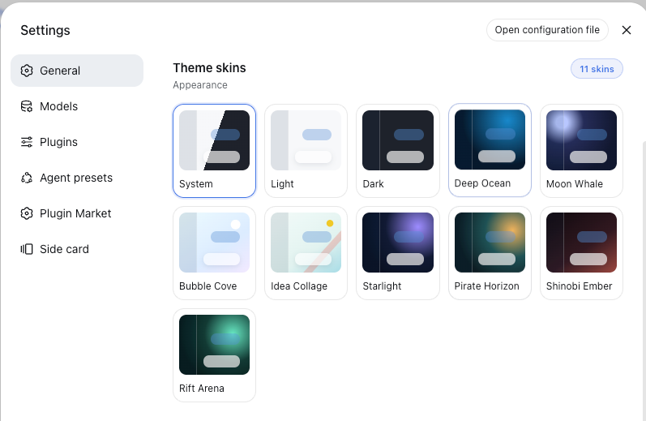
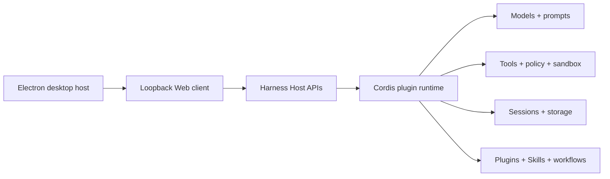

<p align="center">
  
</p>

# Open DSH Desktop

<p align="center">
  <strong>A ready-to-use, dependency-safe desktop edition of DeepSeek Harness</strong>
</p>

English | [中文](README.md)

> We are addressing user-reported bugs. A new release combining upstream updates, bug fixes, and experience improvements is on the way…

<p align="center">
  <a href="https://github.com/flaqai/open-deepseek-harness-desktop/releases"></a>
  <a href="./LICENSE"></a>
  <a href="https://github.com/deepseek-ai/deepseek-harness"></a>
</p>

Open DeepSeek Harness Desktop is an independent, community-maintained desktop distribution of [DeepSeek Harness](https://github.com/deepseek-ai/deepseek-harness). It combines the upstream plugin-based agent runtime with a visual workspace for configuring models, running coding sessions, inspecting execution, and managing extensions.

The project is maintained by the FLAQ AI team from hands-on work integrating models, packaging desktop clients, and operating plugin- and Agent-based product workflows. We publish the reusable engineering layer so startup supervision, dependency safety, cross-platform packaging, and practical integrations can be inspected and improved in the open.

This repository is not an official DeepSeek product. It is released under the [MIT License](LICENSE) and keeps the Harness architecture intact: capabilities remain plugins, while the Electron application acts as a secure local host for the existing Web client.

**Development notice:** Open DeepSeek Harness Desktop is under active development. Features, packaging, and the local data schema may change. This is an independent community project, not an official DeepSeek product.

## Desktop enhancements to the upstream Web experience

This distribution preserves the upstream DeepSeek Harness Web client while adding desktop-specific integration and ready-to-use features.

### A complete desktop host

Electron is more than a wrapper around a Web page. The desktop host supervises the Harness child process, closes to the tray by default, waits for orderly cleanup on every true quit path, delivers system notifications, supports launch at login on macOS, exposes the log, and checks this client's releases. If Harness takes unusually long to start, the startup page offers the log while continuing to wait. Three consecutive early exits instead produce an explicit failure state with retry and log actions rather than an endless “starting” screen.

The tray can reopen the window, reveal the log, toggle notifications and launch at login, and quit safely. Abnormal exits, repeated startup failures, and recovery produce throttled native notifications. Every bridge is capability-scoped: Web content may manage these desktop preferences, reveal the fixed `harness.log`, or query this project's Releases, but it receives no generic shell, filesystem, or arbitrary-URL capability.

### Copy from the desktop client

The Electron host grants sanitized clipboard-write permission to the supervised Harness page, so message, code, and conversation copy controls work in the desktop client just as they do in the upstream Web client. Clipboard reads and unrelated browser permissions remain denied.

### Preset plugin foundation

The installer starts with the Plugin Marketplace, IM connections, Skill picker, font support, and Pocket ready to use. They remain ordinary Harness dependencies: users can uninstall them, and the desktop app respects that decision instead of silently restoring them. Connected installations retain exact npm or pinned Git identities so the market can discover later releases; integrity-checked archives provide an offline fallback. The larger Better Sidebar archive is carried by the installer and prepared only after the main interface becomes usable, with a visible non-blocking progress card.

### Dependency safety before plugin execution

Third-party plugins share the Host's Node.js runtime. One incompatible transitive dependency, orphaned Loader entry, or failed root-plugin mount can otherwise take down the whole Harness before its Settings page is available. This client adds an independent dependency-safety layer before plugin code executes: it reads the profile manifest, lockfile, Bundle order, and installation-level shared runtime, constructs the complete dependency relationship first, and only then decides which plugins may enter the current process.

- **Earlier than plugin execution:** Inspection happens before the faulty plugin is imported and mounted. Even when that plugin cannot start at all, the client can still produce a diagnosis and protect the remaining features.
- **Dependency-graph evidence, not error-string guessing:** Diagnostics expose the conflicting dependency, declared range, actual Host version, and complete reference chain, distinguishing version conflicts, orphaned Bundles, and runtime mount failures.
- **Converge first, quarantine second:** Repair first attempts to make plugins share the Host dependencies supplied by the installation. If safe convergence remains impossible, only the faulty root plugin is removed from the active profile dependencies and startup order instead of failing the whole client.
- **Fail closed and remain recoverable:** Unknown conflicts are not silently accepted, and a faulty plugin is not allowed into the live runtime. The quarantine reason and disposition remain durable, while users can retry repair or explicitly uninstall it from Diagnostics.

This capability must belong to the desktop client's boot layer rather than another ordinary diagnostic plugin. A plugin can run only after dependency resolution and Loader mounting have already succeeded, while this feature must handle failures before that point. Governing extension dependencies before extension code executes is the boundary that lets an open plugin ecosystem coexist with the stability expected by ordinary desktop users.

### Official Codex connection available offline

Each platform installer carries the official DeepSeek Harness [`@deepseek-ai/dsh-subagent-codex`](packages/subagent/subagent-codex/README.md) plugin, a pinned [`@openai/codex`](https://github.com/openai/codex) wrapper, and only the native payload matching that operating system and CPU. It is not installed during startup: onboarding and **Settings → External tools** expose an explicit install action, which uses the packaged target-native archive and does not depend on a system Node, pnpm, or Codex CLI. The plugin remains removable; restart and upgrade never silently restore it.

The official connector currently treats every delegation as an independent, ephemeral Codex task. Codex uses the parent session's working directory and the login, model, MCP, and Skill configuration already present under the local `CODEX_HOME`, but it does not inherit the Harness conversation transcript or persist its temporary Codex thread into the Harness session. The parent receives only the final answer or a sanitized failure diagnostic; intermediate reasoning, tool traffic, raw stderr, and the complete workspace diff are not copied back.

<p align="center">
  
  <br>
  <sub>Using the connected Codex capability from a full-mode session</sub>
</p>

### External coding tools connection center

**Settings → External tools** brings Codex, Claude Code, and placeholders for future Hermes and Trae Providers into one discoverable surface. After a supported Provider is connected, existing and new full-mode sessions receive its tool at the next safe turn boundary; an already running turn is never rewritten, and minimal mode stays intentionally lean. Disconnecting withdraws the tool without deleting Harness sessions or data owned by the external product.

<p align="center">
  
  <br>
  <sub>External tools center: Codex is connected and the other Provider states remain visible</sub>
</p>

### Dynamic tool projection: connection becomes capability

Conventional Agent compositions pin tools to a particular preset: users must choose the right specialized preset in advance, while existing sessions often cannot receive a product connected later. This client treats an external-product connection as independent, durable Host capability state, then dynamically projects `subagent_codex` into each eligible Agent scope at a safe model-request boundary. Users therefore do not need to recreate a conversation or switch to a dedicated “external tools” preset: new and historical sessions both receive the currently connected capability from their next turn.

- **Turn safety:** A connection change never mutates the tool schema in the middle of a request. Connections take effect on the next turn; disconnections wait until the Agent is idle before removing the tool safely.
- **Mode isolation:** Projection is limited to full modes such as `standard`, `code`, and `cordis`; `minimal` remains lean to prevent capability inflation and accidental delegation.
- **Model discovery:** The tool and its product-specific usage guidance appear together. When a user explicitly asks to use Codex, the model is directed to call `subagent_codex` instead of guessing at or searching for a similarly named CLI through Shell.
- **Auditable state:** The external tools actually available to every model request are recorded as an `external-tools/resolved` event. Session recovery and inspection can reconstruct the capability boundary that existed then instead of guessing history from today's settings.

This design separates the conversation, Agent preset, external Provider, and model-visible tools for the current turn into four independently evolving layers. The plugin remains removable, the connection remains revocable, and historical sessions do not break when preset composition changes. The official Codex Provider still treats each delegation as an independent one-shot task: dynamic projection solves capability discovery and session lifecycle, without pretending that the official Provider already supplies persistent Codex threads.

### Preset IM bot connections

Packaged installations seed `dsh-im`, which lets users connect WeChat, Feishu, DingTalk, WeCom, QQ, Slack, Telegram, Discord, and WhatsApp from the client settings through QR codes, app manifests, or existing bot credentials. The channels share one IM management surface, with controls for switching Harness workspaces and rebinding existing sessions. Bot credentials are submitted only to the local Harness Host and managed by protected credential storage. This capability remains a removable plugin; after users remove it, the client does not silently restore it on a later launch.

### Themes and backgrounds

Switch between system, light, dark, and eight product themes; pair them with eight original built-in illustrations or replace the chat background with your own PNG, JPEG, or WebP image. Custom images remain in local browser storage and are not sent to the model. See the [theme and background reference](packages/client/ui-theme/README.md) for formats and size limits.

<table>
  <tr>
    <th width="50%">Theme settings</th>
    <th width="50%">Background settings</th>
  </tr>
  <tr>
    <td align="center"></td>
    <td align="center"></td>
  </tr>
</table>

### Tracking DeepSeek Harness 0.1.1-rc.2

The current desktop baseline incorporates upstream `dsh-v0.1.1-rc.2`. It adds the unified image and DeepSeek Files pipeline, deterministic image admission, credential records and human-driven provider authorization, stable session projections, multiline questions, refined subagent navigation, and standalone pnpm support on Windows. The earlier file and session references, concurrent `web_search`, reasoning passback, persistent PowerShell PTY, dynamic client packages, build Profiles, and branding slots remain available. Electron always passes `--no-open` to `dsh web`, so launching the desktop app does not also open a system browser.

## Release status

The project is in developer preview and may introduce breaking changes. We are preparing the same five desktop release variants listed below. macOS Apple Silicon is the first locally packaged and validated target; the other rows describe the committed release matrix and will become downloadable as their native build and validation work is completed.

## What you can do

- Connect to DeepSeek by default or configure a compatible API base URL, API key reference, and custom model identifiers from onboarding or Settings.
- Open local workspaces, create persistent sessions, stream agent responses, copy messages, remove sessions, and clear conversation history.
- Review model-visible execution records and concise key-step summaries so important tool activity is easier to confirm.
- Invoke Skills and extend the product through Cordis plugins.
- Connect Codex or Claude Code from one surface so full-mode sessions can delegate independent coding tasks to official product subagents.
- Check the fixed official upstream for stable Harness changes and perform a guarded clean fast-forward update from desktop source runs.

## Installation

Download builds only from the official [GitHub Releases](https://github.com/flaqai/open-deepseek-harness-desktop/releases) page. Release assets will follow this matrix:

| Platform | Architecture | Release package |
| --- | --- | --- |
| macOS | Apple Silicon (`arm64`) | `DeepSeek-Harness-macos-arm64.dmg` |
| macOS | Intel (`x64`) | `DeepSeek-Harness-macos-x64.dmg` |
| Windows | `x64` | `DeepSeek-Harness-windows-x64.exe` |
| Linux | Debian / Ubuntu (`x64`) | `DeepSeek-Harness-linux-x64.deb` |
| Linux | Fedora / RHEL (`x64`) | `DeepSeek-Harness-linux-x64.rpm` |

Published releases will also include a `SHA256SUMS` file so downloaded artifacts can be verified before installation. An asset is supported only after it appears on the Releases page; the table itself is not an availability claim.

### macOS

1. Download the package matching your Mac processor and open the `.dmg`.
2. Drag `DeepSeek Harness.app` into the Applications folder.
3. Current open-source builds use ad-hoc signing and are not notarized. If Gatekeeper blocks the first launch, use **System Settings → Privacy & Security → Open Anyway**. Alternatively, after confirming the download came from this repository, run:

   ```bash
   xattr -dr com.apple.quarantine "/Applications/DeepSeek Harness.app"
   ```

> [!CAUTION]
>
> Removing the quarantine attribute bypasses a macOS security check. Use the command only for this exact application path and only for a package downloaded from the official Releases page. You can also try Apple's [Open Anyway](https://support.apple.com/102445) flow under **System Settings → Privacy & Security**.

### Windows

Download and run the Windows x64 installer. Windows may display a reputation-based warning for an unsigned or newly published build; continue only after checking the publisher repository and the release checksum.

### Linux

Install the package matching your distribution:

```bash
# Debian / Ubuntu
sudo apt install "/path/to/DeepSeek-Harness-linux-x64.deb"

# Fedora / RHEL
sudo dnf install "/path/to/DeepSeek-Harness-linux-x64.rpm"
```

<a id="run"></a><a id="run-from-source"></a>

## Quick start

Install Node.js `^22.19.0 || >=24.0.0` and pnpm `11.7.0`, then run:

```sh
git clone https://github.com/flaqai/open-deepseek-harness-desktop.git
cd open-deepseek-harness-desktop
pnpm install
pnpm run build
pnpm run dev:desktop
```

The desktop host starts a local Harness process and opens its loopback Web UI in a hardened Electron window. To run only the Web client from the same checkout:

```sh
pnpm dsh web
```

See the [desktop application reference](apps/desktop/README.md) for environment overrides, process supervision, update behavior, and current limitations. The [Web UI guide](docs/user/guide/index.md) covers the browser workflow.

`pnpm run build` prepares the repository artifacts. `pnpm dsh web` uses those built artifacts without rebuilding. The Web command starts at `http://127.0.0.1:3080` and opens the default browser for a local launch. Pass `--no-open` to keep it server-only; the Electron host always uses this mode.

## Platform status

| Platform | Current status | Next release work |
| --- | --- | --- |
| macOS Apple Silicon | Ad-hoc DMG/ZIP packaging exercised locally | Publish and validate the arm64 release assets |
| macOS Intel | Dedicated x64 Node runtime, DMG/ZIP targets, and platform Codex payload configured | Complete native installation validation on an Intel-compatible runner |
| Windows x64 | Official Node runtime, NSIS target, and final-install smoke test configured | Continue validating real Windows 10/11, PTY, sandboxing, and paths with spaces or Chinese characters |
| Linux x64 | Dedicated x64 Node runtime, DEB/RPM targets, and platform Codex payload configured | Complete native installation validation on target distributions |
| Web | Available from source through `pnpm dsh web` | Continue sharing the same Harness services and configuration |

## Architecture



DeepSeek Harness follows an **everything is a plugin** architecture powered by [Cordis](https://github.com/cordiverse/cordis). The desktop window does not become a second runtime: configuration, credentials, sessions, plugins, and Skills remain owned by Harness services. Start with the [architecture documentation](docs/architecture.md) and [development guide](docs/development.md) before changing packages.

## Plugins and Skills

The home and Settings surfaces expose plugin discovery and supported installation actions. Registry installation uses validated package specifications, explicit confirmation, streamed command output, and a restart-required result; it is not a generic shell prompt. Add the [`dsh-plugin`](https://github.com/topics/dsh-plugin) topic to a compatible plugin repository so users can find it.

Skills remain managed through Harness providers and are invoked in the same session context as the rest of the agent. Plugin authors should use documented service definitions, providers, consumers, effects, and configuration instead of Electron-only state.

## Security and privacy

The renderer runs with Node integration disabled, context isolation enabled, and Chromium sandboxing enabled. Navigation is restricted to the exact loopback Harness origin, renderer permission requests are denied, and no generic command or filesystem bridge is exposed to Web content.

API keys remain owned by the Harness credentials service. Do not commit credentials. Before selecting any compatible provider, review its endpoint, model support, tool-calling behavior, pricing, rate limits, and data-handling terms.

## Free API-token options for evaluation

Users who want to try Harness before purchasing model credits can evaluate these OpenAI-compatible options. They are independent third-party services, are not bundled or selected by default, and may change their free quotas, model names, rate limits, logging policies, or availability at any time.

- **[Agnes AI](https://agnes-ai.com/)** — offers an API-key application and free-access entry for its multimodal gateway. Add it as an OpenAI-compatible provider with Base URL `https://apihub.agnes-ai.com/v1`; `agnes-2.5-flash` is the current general choice for coding, reasoning, tool calling, and Agent workflows. Confirm the account's current Token Plan and limits in the Agnes console before relying on it.
- **[OpenRouter · Ox Alpha](https://openrouter.ai/stealth/ox-alpha?view=api)** — use Base URL `https://openrouter.ai/api/v1` and model ID `stealth/ox-alpha`. Its current catalog price is zero for input and output tokens, but stealth/alpha models are previews and may be renamed, withdrawn, rate-limited, or repriced. OpenRouter's account-level free-model limits still apply.

Create keys only on the providers' official sites and save them through Harness credentials. Never paste API tokens into issues, screenshots, README files, or committed configuration.

## Project direction

- Produce reproducible macOS arm64/x64 DMG, Windows x64 EXE, and Linux x64 DEB/RPM releases with checksums and generated third-party notices.
- Improve plugin and Skill discovery, compatibility metadata, lifecycle management, and update visibility.
- Build on the existing tray, notifications, and startup diagnostics with native approvals, richer task status, deep links, and an authenticated local control endpoint.
- Improve interactive approval, progress, change summaries, and resumable sessions for external coding tools while keeping the Harness and product context boundaries explicit.
- Continue strengthening identity mapping, authorization, audit events, rate limits, and revocation for the preset IM bot connections.

These items describe direction, not completed support. See the [desktop release matrix](apps/desktop/README.md#cross-platform-release-matrix) for the current implementation boundary.

## Documentation and community

- Read the [user guide](docs/user/guide/index.md), [plugin introduction](docs/user/develop/framework/index.md), and [Skill guide](docs/subsystems/skills.md).
- Use [GitHub Issues](https://github.com/flaqai/open-deepseek-harness-desktop/issues) for reproducible bugs and feature requests.
- Discuss the upstream runtime in [DeepSeek Harness Discussions](https://github.com/deepseek-ai/deepseek-harness/discussions) or its [Discord community](https://discord.gg/Ycq5dCaS4).
- See [CONTRIBUTING.md](CONTRIBUTING.md) before contributing and [AGENTS.md](AGENTS.md) when working with coding agents in this repository.

## Acknowledgements

Thank you to the [DeepSeek Harness](https://github.com/deepseek-ai/deepseek-harness) maintainers for the official Codex Provider, and to [OpenAI Codex](https://github.com/openai/codex) for its pinned wrapper and native platform runtimes. This project packages those official components for each target and integrates them with the desktop connection center.

Thank you to the authors and maintainers of these community plugins. The startup set is removable, while the larger Better Sidebar remains an explicit install:

- [`dsh-im`](https://github.com/xmanrui/dsh-im), maintained by [xmanrui](https://github.com/xmanrui): connects nine IM bot channels, including WeChat and Feishu.
- [`dsh-skill-picker`](https://github.com/a735624258/dsh-skill-picker), maintained by [a735624258](https://github.com/a735624258): selects a Skill from the composer and inserts the Harness Skill invocation.
- [`dsh-market`](https://github.com/dsh-market/dsh-market), maintained by the [dsh-market](https://github.com/dsh-market) community: browses, searches, installs, and manages plugins inside Harness.
- [`dsh-font`](https://github.com/tianyhjg-lab/dsh-font): provides client font customization from a pinned Git revision.
- [`dsh-pocket`](https://github.com/shaobeichen/dsh-pocket): provides the Pocket extension included in the startup set.
- [`DSH Better Sidebar`](https://github.com/omdsh-dev/DSH-better-sidebar): provides the optional enhanced sidebar installed only on request.

## About the FLAQ AI team

[FLAQ.AI](https://flaq.ai/) provides unified API access to image, video, music, and language models for AI Agents and production applications, together with documentation and developer-oriented workflows. This desktop project comes from the team's recurring work around model integration, local Agent environments, plugin delivery, and cross-platform application packaging; open-sourcing it turns those implementation lessons into an inspectable and reusable community project.

Related open-source projects include [Backlink Skills](https://github.com/flaqai/backlink_skills), [Awesome Codex Skills](https://github.com/flaqai/awesome_codex_skills), and [Awesome Claude Code Skills](https://github.com/flaqai/awesome_claude_code_skills).

FLAQ.AI remains an optional compatible provider or companion platform. It is not required to run this repository, is not configured as a hidden default, and does not imply endorsement by DeepSeek. Provider capabilities, availability, and commercial terms can change, so confirm current details in the [FLAQ.AI documentation](https://flaq.ai/docs/) before production use.

## License

Open DeepSeek Harness Desktop is available under the [MIT License](LICENSE). Third-party dependencies and their licenses are disclosed in [THIRD_PARTY_NOTICES.md](THIRD_PARTY_NOTICES.md).
