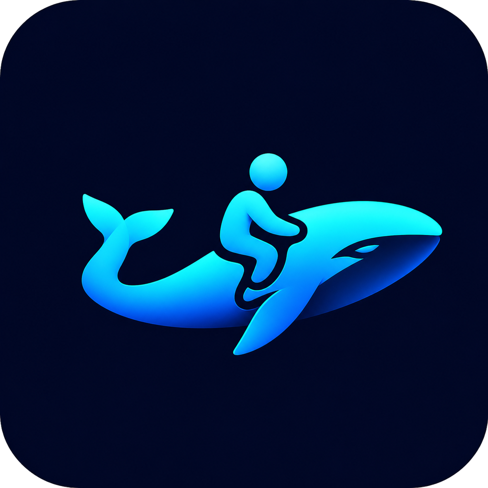
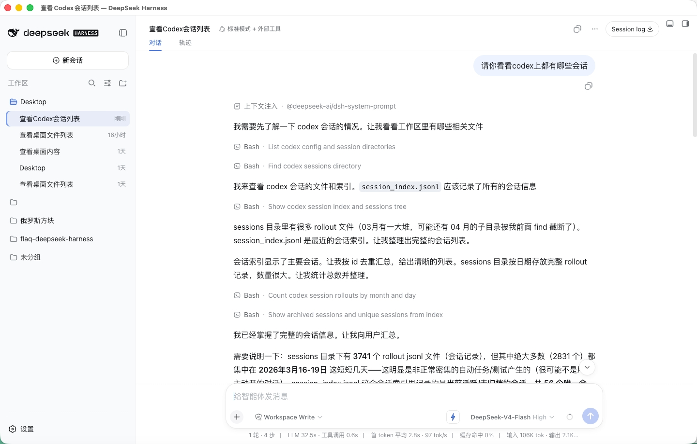
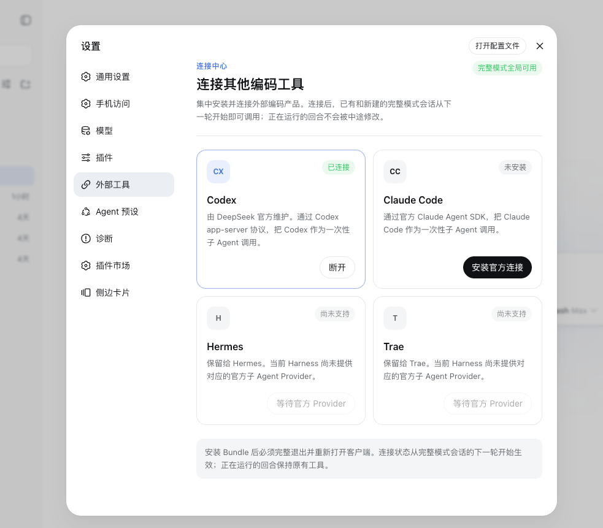
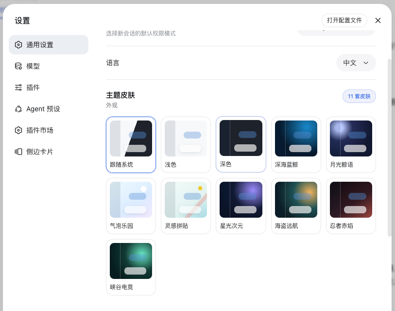
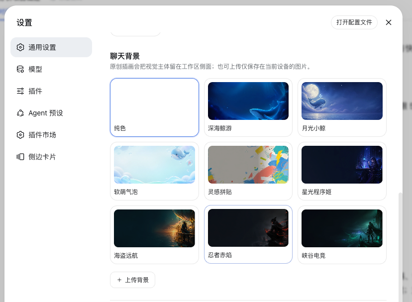
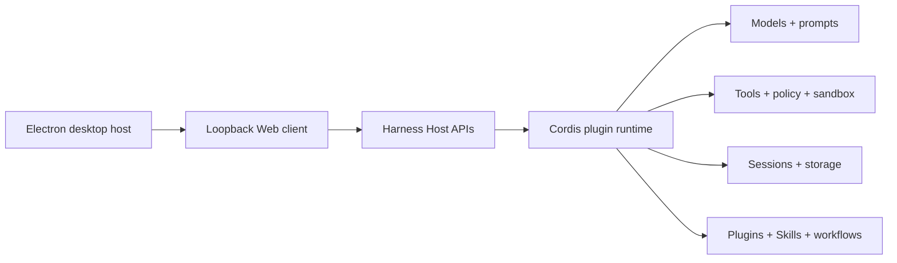

<p align="center">
  
</p>

# Open DSH Desktop

<p align="center">
  <strong>开箱即用、依赖安全的 DeepSeek Harness 桌面版</strong>
</p>

语言：简体中文（默认） · [English](README.en.md) · [日本語](README.ja.md) · [한국어](README.ko.md) · [Español](README.es.md) · [Français](README.fr.md) · [Deutsch](README.de.md) · [Português](README.pt-BR.md)

> 正在处理各位用户的bug，结合官方更新、bug修复和体验优化的新版本准备出炉……

<p align="center">
  <a href="https://github.com/flaqai/open-deepseek-harness-desktop/releases"></a>
  <a href="./LICENSE"></a>
  <a href="https://github.com/deepseek-ai/deepseek-harness"></a>
</p>

Open DeepSeek Harness Desktop 是由社区独立维护的 [DeepSeek Harness](https://github.com/deepseek-ai/deepseek-harness) 桌面发行版。它将上游基于插件的智能体运行时与可视化工作区结合起来，可用于配置模型、运行编码会话、查看执行过程和管理扩展。

本项目由 FLAQ AI 团队基于模型接入、桌面客户端打包和插件化 Agent 产品工作流的一线实践持续维护。我们把其中可复用的工程层开源出来，让启动监管、依赖安全、跨平台打包和实用集成能够被公开检查、复用并共同改进。

本仓库并非 DeepSeek 官方产品。项目采用 [MIT 许可证](LICENSE)，并保留 Harness 的架构原则：各项能力仍由插件提供，Electron 应用仅作为现有 Web 客户端的安全本地宿主。

**开发提示：** Open DeepSeek Harness Desktop 正在积极开发中，功能、打包方式和本地数据结构可能发生变化。本项目由社区独立维护，并非 DeepSeek 官方产品。

## 相比官方 Web 版的桌面增强

本项目保留 DeepSeek Harness 官方 Web 客户端的使用体验，并加入适合桌面应用的系统集成和开箱即用功能。

### 完整的桌面宿主

Electron 不只是包住 Web 页面的外壳。桌面宿主负责 Harness 子进程监管、默认关闭到托盘、完整退出时的有序清理、系统通知、macOS 开机启动、日志入口和客户端版本检查。若 Harness 启动时间过长，启动页会提供日志入口并继续等待；连续三次提前退出后则进入明确的失败状态，可直接重试或打开日志，不再无限停留在“正在启动”。

托盘菜单可以重新打开窗口、查看日志、切换通知与开机启动并安全退出。异常退出、连续启动失败和恢复成功会触发带节流的原生通知。所有桥接能力均是闭集接口：渲染页面只能管理这些桌面偏好、打开固定的 `harness.log` 或查询本项目 Release，不能获得通用 Shell、文件系统或任意 URL 打开权限。

### 客户端复制

Electron 宿主仅向受监管的 Harness 页面授予经过净化的剪贴板写入权限，因此消息、代码和对话的复制按钮可以像官方 Web 端一样在桌面客户端正常使用。剪贴板读取及其他无关的浏览器权限仍保持禁用。

### 预设插件基础能力

安装包启动后即可使用插件市场、IM 连接、Skill 选择器、字体支持和 Pocket。它们仍是普通 Harness 依赖：用户可以卸载，桌面应用会尊重该选择，不会再次自动安装。联网安装会保留精确 npm 版本或固定 Git 提交身份，使插件市场可以发现后续更新；经过完整性校验的内置归档负责离线回退。体积更大的 Better Sidebar 归档也随安装包提供，但会等主界面可用后才准备，并通过可见、非阻塞的进度卡展示状态。

### 插件执行前的依赖安全层

第三方插件与 Host 共享 Node.js 运行时，一个不兼容的间接依赖、残留 Loader 条目或根插件挂载失败，都可能在设置页打开之前拖垮整个 Harness。本客户端在插件代码执行前增加了独立的依赖安全层：它读取 profile 清单、锁文件、Bundle 顺序和安装级共享运行时，先构建完整依赖关系，再决定哪些插件可以进入当前进程。

- **早于插件执行**：检查发生在故障插件被 `import` 和挂载之前。即使该插件自身完全无法启动，客户端仍能给出诊断并保护其他功能。
- **基于依赖图，而非猜测报错文本**：诊断会展示冲突依赖、声明范围、Host 实际版本和完整引用链，可区分版本冲突、孤立 Bundle 与运行时挂载故障。
- **先收敛，后隔离**：修复会先尝试让插件统一使用安装包提供的共享 Host 依赖。仍无法安全收敛时，只将故障根插件移出当前 profile 的活动依赖和启动顺序，而不是让整个客户端失败。
- **失败关闭且可恢复**：未知冲突不会被静默忽略，故障插件也不会带病进入运行时。隔离原因和处置状态会持久保留，用户可在诊断页重试修复或确认卸载。

这项能力必须由桌面客户端的启动层持有，不能再做成一个普通诊断插件：插件只有在依赖解析和 Loader 挂载已经成功后才能运行，而本功能要处理的正是这个时点之前的失败。这种“在扩展代码之前治理扩展依赖”的边界，让开放的插件生态与普通用户需要的客户端稳定性可以同时存在。

### 可离线安装的官方 Codex 连接

各平台安装包携带 DeepSeek Harness 官方 [`@deepseek-ai/dsh-subagent-codex`](packages/subagent/subagent-codex/README.md) 插件、固定版本的 [`@openai/codex`](https://github.com/openai/codex) wrapper，以及仅与当前系统和 CPU 匹配的原生载荷。它不会在启动阶段自动安装：首次引导与“设置 → 外部工具”提供明确的安装操作，点击后使用安装包内与平台匹配的归档，不依赖用户系统中另行安装 Node、pnpm 或 Codex CLI。该插件仍可卸载，应用升级或重启不会擅自装回。

官方连接当前把每次委派作为一个独立、临时的 Codex 任务：Codex 使用父会话的工作目录和本机 `CODEX_HOME` 中已有的登录、模型、MCP 与 Skill 配置，但不会继承 Harness 的对话正文，也不会把临时 Codex thread 保存到 Harness 会话。父会话只收到最终回答或经过脱敏的失败诊断；Codex 的中间推理、工具通信、原始 stderr 与完整工作区差异不会被复制回来。

<p align="center">
  
  <br>
  <sub>在完整模式会话中使用已连接的 Codex 能力</sub>
</p>

### 外部编码工具连接中心

“设置 → 外部工具”集中展示 Codex、Claude Code 以及等待正式 Provider 的 Hermes、Trae。连接受支持的 Provider 后，已有和新建的完整模式会话会从下一轮安全边界获得对应工具，正在运行的回合不会被中途改写，精简模式也继续保持最小工具集。断开连接只撤下工具，不删除 Harness 会话或外部产品自身的数据。

<p align="center">
  
  <br>
  <sub>外部工具连接中心：Codex 已连接，其他 Provider 状态集中展示</sub>
</p>

### 动态工具投影：连接即能力

常见的 Agent 组装方式会把工具固定在某个预设中：用户需要先选对专用预设，已有会话则往往无法获得后来连接的能力。本客户端把“外部产品连接”作为独立、持久的 Host 能力状态，再在每个模型请求的安全边界，将 `subagent_codex` 动态投影到符合条件的 Agent 作用域。因此，用户无需重建会话，也不必切换到专用的“外部工具”预设：新会话和历史会话都会从下一轮获得当前已连接的能力。

- **回合安全**：连接变化不会在请求执行中突然改变工具 schema。连接在下一轮生效；断开则等待 Agent 回到空闲状态后安全撤载。
- **模式隔离**：只向 `standard`、`code`、`cordis` 等完整模式投影；`minimal` 继续保持精简，避免能力膨胀和无意委派。
- **模型可发现**：工具与产品专用使用提示一起动态出现。当用户明确要求使用 Codex 时，模型会优先调用 `subagent_codex`，而不是去 Shell 中猜测或寻找同名 CLI。
- **状态可追溯**：每个模型请求实际获得的外部工具会记录为 `external-tools/resolved` 事件。恢复和审计会话时，可以重建当时的能力边界，而不是用当前设置猜测历史。

这种设计将“会话”、“Agent 预设”、“外部 Provider”和“本轮模型可见工具”分成四个可独立演进的层次：插件仍可卸载，连接仍可随时撤销，历史会话也不会因为预设变化而失效。当前官方 Codex Provider 仍把每次委派作为独立的一次性任务；动态投影解决的是能力发现与会话生命周期问题，不会假装官方 Provider 已具备持久 Codex thread。

### 预设 IM 机器人连接

安装包预设 `dsh-im`，可从客户端设置中通过扫码、应用清单或已有机器人凭据连接微信、飞书、钉钉、企业微信、QQ、Slack、Telegram、Discord 和 WhatsApp。不同渠道统一在一个 IM 管理入口中配置，并可为机器人切换 Harness 工作区或重新绑定已有会话。机器人凭据只提交给本机 Harness Host，并由受保护的凭据存储管理。该功能仍由可卸载插件提供；用户移除后，客户端不会在后续启动时擅自装回。

### 主题与背景

你可以在跟随系统、浅色、深色及八套产品主题之间切换，并搭配八张原创内置插画，或使用自己的 PNG、JPEG、WebP 图片替换聊天背景。自定义图片仅保存在本地浏览器存储中，不会发送给模型。支持格式与大小限制见[主题与背景参考](packages/client/ui-theme/README.md)。

<table>
  <tr>
    <th width="50%">主题栏</th>
    <th width="50%">背景栏</th>
  </tr>
  <tr>
    <td align="center"></td>
    <td align="center"></td>
  </tr>
</table>

### 跟进 DeepSeek Harness 0.1.1-rc.2

当前桌面基线已同步上游 `dsh-v0.1.1-rc.2`。本次新增统一图片与 DeepSeek Files 管线、确定性的图片准入、凭据记录与用户主导的提供商授权、稳定的会话投影、多行问题、更清晰的子 Agent 导航，以及 Windows 独立 pnpm 支持。此前的文件与 Session 引用、多查询并发 `web_search`、推理内容回传、持久 PowerShell PTY、动态客户端包、构建 Profile 与品牌插槽继续保留；Electron 始终为 `dsh web` 传入 `--no-open`，因此启动桌面应用不会额外打开系统浏览器。

## 发布状态

项目目前处于开发者预览阶段，可能发生破坏兼容性的变更。我们将准备下方列出的五种桌面发行版本。macOS Apple Silicon 是首个在本地完成打包与验证的目标；其他行代表已经确定的发行矩阵，会在对应原生构建与验证工作完成后提供下载。

## 现有能力

- 默认接入 DeepSeek，也可在首次引导或设置中配置兼容 API 的基础地址、API 密钥引用和自定义模型标识。
- 打开本地工作区、创建持久会话、流式接收智能体回复、复制消息、删除会话和清空对话记录。
- 查看进入模型上下文的执行记录与精简的关键步骤摘要，便于确认重要工具操作。
- 调用 Skill，并通过 Cordis 插件扩展产品。
- 从统一连接中心启用 Codex 或 Claude Code，使完整模式会话能够把独立编码任务委派给官方产品型子 Agent。
- 检查固定的官方上游稳定变更，并在桌面源码运行模式下执行受保护的干净快进更新。

## 安装

请只从本项目的官方 [GitHub Releases](https://github.com/flaqai/open-deepseek-harness-desktop/releases) 页面下载安装包。发行产物将遵循以下矩阵：

| 平台 | 架构 | 发行包 |
| --- | --- | --- |
| macOS | Apple Silicon（`arm64`） | `DeepSeek-Harness-macos-arm64.dmg` |
| macOS | Intel（`x64`） | `DeepSeek-Harness-macos-x64.dmg` |
| Windows | `x64` | `DeepSeek-Harness-windows-x64.exe` |
| Linux | Debian / Ubuntu（`x64`） | `DeepSeek-Harness-linux-x64.deb` |
| Linux | Fedora / RHEL（`x64`） | `DeepSeek-Harness-linux-x64.rpm` |

正式发布时还会提供 `SHA256SUMS` 文件，便于在安装前校验下载产物。只有实际出现在 Releases 页面中的文件才属于可用版本；此表本身不代表对应安装包已经发布。

### macOS

1. 下载与 Mac 处理器相符的安装包并打开 `.dmg`。
2. 将 `DeepSeek Harness.app` 拖入“应用程序”文件夹。
3. 当前开源构建使用 ad-hoc 签名且未经 Apple 公证。若 Gatekeeper 阻止首次打开，请前往**系统设置 → 隐私与安全性 → 仍要打开**。也可以在确认文件来自本仓库后执行：

   ```bash
   xattr -dr com.apple.quarantine "/Applications/DeepSeek Harness.app"
   ```

> [!CAUTION]
>
> 移除 quarantine 属性会绕过 macOS 安全检查。此命令仅适用于从官方 Releases 页面下载并安装到上述准确路径的 `DeepSeek Harness.app`，切勿将路径替换为宽泛目录。也可以前往**系统设置 → 隐私与安全性**，尝试 Apple 的[“仍要打开”](https://support.apple.com/102445)功能。

### Windows

下载并运行 Windows x64 安装程序。对于未签名或刚发布的版本，Windows 可能显示基于信誉的安全警告；继续安装前请确认仓库来源并核对发行校验值。

### Linux

请选择与发行版匹配的软件包：

```bash
# Debian / Ubuntu
sudo apt install "/path/to/DeepSeek-Harness-linux-x64.deb"

# Fedora / RHEL
sudo dnf install "/path/to/DeepSeek-Harness-linux-x64.rpm"
```

<a id="run"></a><a id="run-from-source"></a>

## 快速开始

安装 Node.js `^22.19.0 || >=24.0.0` 与 pnpm `11.7.0`，然后执行：

```sh
git clone https://github.com/flaqai/open-deepseek-harness-desktop.git
cd open-deepseek-harness-desktop
pnpm install
pnpm run build
pnpm run dev:desktop
```

桌面宿主会启动本地 Harness 进程，并在经过加固的 Electron 窗口中打开其回环地址 Web UI。若只需从同一份源码运行 Web 客户端：

```sh
pnpm dsh web
```

环境变量覆盖、进程监管、更新行为和现有限制见[桌面应用参考](apps/desktop/README.md)。浏览器端工作流见 [Web UI 指南](docs/user/guide/index.md)。

`pnpm run build` 会准备仓库产物。`pnpm dsh web` 会直接使用这些已构建产物，不会重新构建。Web 命令默认在 `http://127.0.0.1:3080` 启动，并在本机启动时打开默认浏览器。传入 `--no-open` 可只运行服务器；Electron 宿主始终使用该模式。

## 平台状态

| 平台 | 当前状态 | 后续发布工作 |
| --- | --- | --- |
| macOS Apple Silicon | 已在本地验证 ad-hoc DMG/ZIP 打包 | 发布并验证 arm64 发行产物 |
| macOS Intel | 已配置独立 x64 Node 运行时、DMG/ZIP 和平台 Codex 载荷 | 在兼容 Intel 的运行器上完成原生安装验证 |
| Windows x64 | 已配置官方 Node、NSIS 与最终安装烟雾测试 | 持续验证真实 Windows 10/11、PTY、沙箱及含空格/中文路径 |
| Linux x64 | 已配置独立 x64 Node 运行时、DEB/RPM 和平台 Codex 载荷 | 在目标发行版上完成原生安装验证 |
| Web | 可通过源码命令 `pnpm dsh web` 使用 | 继续与桌面端共享相同的 Harness 服务和配置 |

## 架构



DeepSeek Harness 采用由 [Cordis](https://github.com/cordiverse/cordis) 驱动的**一切皆插件**架构。桌面窗口不会成为第二套运行时：配置、凭据、会话、插件和 Skill 仍由 Harness 服务统一管理。修改软件包前，请先阅读[架构文档](docs/architecture.md)和[开发指南](docs/development.md)。

## 插件与 Skill

首页和设置界面提供插件发现与受支持的安装操作。注册表安装会校验包标识、要求明确确认、流式展示命令输出并返回需要重启的结果；它不是通用 Shell 输入框。为兼容插件仓库添加 [`dsh-plugin`](https://github.com/topics/dsh-plugin) 话题，可帮助用户发现插件。

Skill 继续由 Harness 提供程序管理，并与智能体的其他能力在同一会话上下文中调用。插件作者应使用已有的服务定义、提供程序、消费者、effect 和配置机制，不应依赖 Electron 专属状态。

## 安全与隐私

渲染进程禁用 Node 集成，启用上下文隔离和 Chromium 沙箱。页面导航仅允许准确的 Harness 回环来源，渲染进程权限请求会被拒绝，Web 内容也无法访问通用命令或文件系统桥接。

API 密钥仍由 Harness 凭据服务管理，请勿提交凭据。选择任何兼容提供商前，请核对其端点、模型支持、工具调用行为、价格、速率限制和数据处理条款。

## 可免费试用的 API Token 渠道

希望先体验 Harness、暂不购买模型额度的用户，可以评估以下 OpenAI 兼容渠道。它们都是独立第三方服务，本项目不会内置或默认选中；免费额度、模型名称、速率限制、日志政策和可用性都可能随时变化。

- **[Agnes AI](https://agnes-ai.com/)**：提供 API Key 申请和多模态网关的免费使用入口。可按 OpenAI 兼容提供商添加，Base URL 填写 `https://apihub.agnes-ai.com/v1`；当前适合编码、推理、工具调用和 Agent 工作流的通用选择是 `agnes-2.5-flash`。正式依赖前请在 Agnes 控制台确认账号当前的 Token Plan 与限额。
- **[OpenRouter · Ox Alpha](https://openrouter.ai/stealth/ox-alpha?view=api)**：Base URL 使用 `https://openrouter.ai/api/v1`，模型 ID 使用 `stealth/ox-alpha`。其当前目录价格为输入、输出 Token 均为零，但 stealth/alpha 模型属于预览能力，之后可能改名、下线、限流或调整价格，同时仍受 OpenRouter 账号级免费模型限额约束。

请只在提供商官方网站创建 Key，并通过 Harness 凭据服务保存。不要把 API Token 粘贴到 Issue、截图、README 或会被提交的配置文件中。

## 项目方向

- 提供可复现的 macOS arm64/x64 DMG、Windows x64 EXE 和 Linux x64 DEB/RPM 版本，并附带校验值与第三方许可证声明。
- 改进插件与 Skill 的发现、兼容性元数据、生命周期管理和更新可见性。
- 在现有托盘、通知和启动诊断基础上，继续增加原生审批、更丰富的任务状态、深度链接和经过身份验证的本地控制端点。
- 完善外部编码工具的交互审批、任务进度、修改摘要与可恢复会话，同时保持 Harness 与外部产品的上下文边界清晰可见。
- 继续完善预设 IM 机器人连接的身份映射、授权、审计事件、速率限制和撤销能力。

以上内容是项目方向，并不代表已经完成支持。当前实现边界见[桌面发行矩阵](apps/desktop/README.md)。

## 文档与社区

- 阅读[用户指南](docs/user/guide/index.md)、[插件介绍](docs/user/develop/framework/index.md)和 [Skill 指南](docs/subsystems/skills.md)。
- 通过 [GitHub Issues](https://github.com/flaqai/open-deepseek-harness-desktop/issues) 提交可复现的缺陷和功能建议。
- 在 [DeepSeek Harness Discussions](https://github.com/deepseek-ai/deepseek-harness/discussions) 或其 [Discord 社区](https://discord.gg/Ycq5dCaS4)讨论上游运行时。
- 贡献前请阅读 [CONTRIBUTING.md](CONTRIBUTING.md)；使用编码智能体处理本仓库时请遵循 [AGENTS.md](AGENTS.md)。

## 致谢

感谢 [DeepSeek Harness](https://github.com/deepseek-ai/deepseek-harness) 上游维护官方 Codex Provider，并感谢 [OpenAI Codex](https://github.com/openai/codex) 提供其固定版本的 wrapper 与各平台原生运行时。本项目仅负责把这些官方组件按目标平台离线打包并接入桌面连接中心。

感谢以下社区插件的作者与维护者。启动预设均可卸载；体积较大的 Better Sidebar 保持为用户明确触发的安装项：

- [`dsh-im`](https://github.com/xmanrui/dsh-im)，由 [xmanrui](https://github.com/xmanrui) 维护：连接微信、飞书等九种 IM 机器人。
- [`dsh-skill-picker`](https://github.com/a735624258/dsh-skill-picker)，由 [a735624258](https://github.com/a735624258) 维护：在输入区选择 Skill，并插入 Harness 的 Skill 调用指令。
- [`dsh-market`](https://github.com/dsh-market/dsh-market)，由 [dsh-market](https://github.com/dsh-market) 社区维护：在 Harness 内浏览、搜索、安装和管理插件。
- [`dsh-font`](https://github.com/tianyhjg-lab/dsh-font)：通过固定 Git 提交提供客户端字体定制。
- [`dsh-pocket`](https://github.com/shaobeichen/dsh-pocket)：提供启动阶段预设的 Pocket 扩展。
- [`DSH Better Sidebar`](https://github.com/omdsh-dev/DSH-better-sidebar)：提供仅在用户明确请求后安装的增强侧边栏。

## 关于 FLAQ AI 团队

[FLAQ.AI](https://flaq.ai/) 面向 AI Agent 和生产应用，提供图片、视频、音乐及语言模型的统一 API 接入、文档和开发者工作流。本桌面项目来自团队在模型集成、本地 Agent 环境、插件交付与跨平台应用打包中的反复实践；我们将它开源，是希望把这些实施经验整理成可检查、可复用、可继续改进的社区项目。

相关开源项目包括 [Backlink Skills](https://github.com/flaqai/backlink_skills)、[Awesome Codex Skills](https://github.com/flaqai/awesome_codex_skills) 和 [Awesome Claude Code Skills](https://github.com/flaqai/awesome_claude_code_skills)。

FLAQ.AI 仍只是可选的兼容提供商或配套平台。运行本仓库不依赖 FLAQ.AI，项目也不会将其设为隐藏默认服务；提及 FLAQ.AI 不代表 DeepSeek 对其背书。提供商能力、可用性和商业条款可能变化，投入生产前请在 [FLAQ.AI 文档](https://flaq.ai/docs/)中核对最新信息。

## 许可证

Open DeepSeek Harness Desktop 采用 [MIT 许可证](LICENSE)。第三方依赖及其许可证见 [THIRD_PARTY_NOTICES.md](THIRD_PARTY_NOTICES.md)。

## Friends

- [DSHFind](https://dshfind.com/zh) — DeepSeek Harness 中文学习与分享社区，汇集入门教程、插件生态与社区内容。
