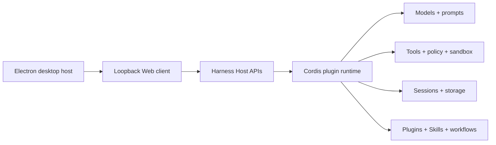

<p align="center">
  
</p>

# Open DeepSeek Harness Desktop

<p align="center">
  <strong>开箱即用、依赖安全的 DeepSeek Harness 社区桌面版</strong>
</p>

语言：简体中文（默认） · [English](.github/readme/README.en.md) · [日本語](.github/readme/README.ja.md) · [한국어](.github/readme/README.ko.md) · [Español](.github/readme/README.es.md) · [Français](.github/readme/README.fr.md) · [Deutsch](.github/readme/README.de.md) · [Português](.github/readme/README.pt-BR.md)

> [!IMPORTANT]
>
> **[v0.1.6-alpha.2 已发布，欢迎下载体验](https://github.com/flaqai/open-deepseek-harness-desktop/releases/tag/odsh-v0.1.6-alpha.2)。** 本版本同步官方 [DeepSeek Harness `dsh-v0.1.6-alpha.2`](https://github.com/deepseek-ai/deepseek-harness/releases/tag/dsh-v0.1.6-alpha.2)，加入插件管理、回合文件改动审阅、Office 与网页侧栏预览、Subagent 会话和计划预览，并保留社区桌面的独立数据目录、诊断恢复、预置插件与更新渠道。
>
> 虽然版本名包含 `alpha`，社区构建已在 GitHub 上按正式 Release 发布。升级前仍建议备份重要配置，并将遇到的问题连同日志或诊断报告反馈给我们。

<p align="center">
  <a href="https://github.com/flaqai/open-deepseek-harness-desktop/releases"></a>
  <a href="./LICENSE"></a>
  <a href="https://github.com/deepseek-ai/deepseek-harness"></a>
</p>

Open DeepSeek Harness Desktop 是由社区独立维护的 [DeepSeek Harness](https://github.com/deepseek-ai/deepseek-harness) 桌面发行版。它把上游插件化智能体运行时、Web 工作区和桌面系统能力组合为可以直接安装的应用，可用于配置模型、运行编码会话、查看执行轨迹、管理插件与 Skill，并连接外部编码工具或 IM 机器人。

安装包内置 Node.js、pnpm 与 Harness 运行时，无需用户先准备开发环境。本项目不会把 Electron 变成第二套智能体运行时：配置、凭据、会话、插件和 Skill 仍由本机 Harness 服务管理，Electron 只提供受限的桌面宿主能力。

> [!NOTE]
>
> 本仓库并非 DeepSeek 官方产品，而是基于 DeepSeek Harness 的社区开源项目。项目仍处于预览阶段，本地数据结构、插件兼容策略和安装方式可能继续演进。

## 当前功能亮点

- [AI 会话工作台](#ai-会话工作台)：可调正文、回合导航、精确 Token、发送队列，以及更完整的图片与文件体验。
- [首次启动与独立配置环境](#首次启动与独立配置环境)：导入官方配置、复用社区桌面版配置或全新开始。
- [NAS 运行端（预览）](#nas-运行端预览)：社区提供的 Linux NAS 运行端，让多台桌面客户端连接同一套 Profile、会话和 Workspace。
- [插件发现、安装与更新](#插件发现安装与更新)：真实市场目录、分类推荐、本机状态、立即安装和联网更新。
- [0.1.6 实验能力](#官方-016-实验能力)：从设置页按需安装 Browser Use、Computer Use 与 Auto review。
- [内置工作运行时](#内置工作运行时)：使用安装包内置或本机 Python，分别启用 Office 工具包与实验性 Python PTC。
- [超级强化的诊断检查](#超级强化的诊断检查)：启动前检查 pnpm、Cordis 和 Loader，并提供演练、隔离与恢复。
- [设置界面自定义](#设置界面自定义)：设置类型可以滚动、拖动排序并保存用户自己的排列。
- [桌面客户端体验](#桌面客户端体验)：原生安装、托盘、快速重启、通知、日志、应用内更新和系统集成。

## AI 会话工作台

桌面客户端包含完整的 DeepSeek Harness 会话体验。已完成回答可以折叠过程内容和 System Prompt；正文宽度与字号可以调整，Markdown 表格会随正文字号缩放；紧凑的回合导航和精确 Token 用量便于检查长会话，流式生成的代码块会持续保持语法高亮。

提问历史以更易读的问答卡片展示，并区分完成、取消与中断状态。切换会话会保留尚未提交的提问卡片；会话仍在运行时也可以继续输入，主按钮会切换为发送，新消息进入发送队列。

会话归档后不会删除内容。可以从“设置 → 已归档会话”按 Workspace 搜索和筛选归档项，恢复单条或全部会话；恢复后会回到原 Workspace，历史消息保持不变。

图片发送后会立即显示，压缩和上传在后台继续；超长截图会兼顾体积与清晰度，图片占用也会纳入上下文压缩计算。轨迹视图可以展示用户、助手和工具结果中的图片，本地文件模式可以定位已经上传的图片，编辑相邻文字不会使输入框中的文件或会话引用失效。

## 首次启动与独立配置环境

首次启动时，客户端会先检查默认的官方 DSH 数据目录 `~/.dsh`。如果该目录不存在或不是受支持的数据目录，仍可手动选择其他位置，也可以直接创建全新的客户端环境。目录选择页提供中文和英文切换，不必先进入应用设置。

### 导入到独立环境

将受支持的数据复制到桌面客户端自己的数据目录，来源目录保持不变。可导入内容包括设置、凭据、会话、工作区信息、Agent 预设、Skill 和连接状态。

导入不会复制 Profile、`node_modules`、锁文件、插件运行时、内置插件标记、隔离与健康记录或匿名用户标识。插件配置和插件清单会被识别，但插件本体需要在客户端的独立 Profile 中重新安装。导入完成后，客户端与官方 DSH CLI/Web 环境互不影响。

<p align="center">
  
  <br>
  <sub>导入到独立环境：复制受支持数据，来源目录保持不变</sub>
</p>

### 复用社区桌面版配置

官方 `~/.dsh` 只能导入到独立环境，不再提供直接共享选项。Open DeepSeek Harness Desktop 创建或采用配置目录时会写入专用身份文件；具有该身份文件或有效旧版桌面设置记录的社区配置可以直接复用。对于只有可识别 DSH 数据、但缺少两种记录的旧目录，应用会明确询问是否确实来自旧版 Open DeepSeek Harness Desktop；用户确认后才允许继续。损坏或明确属于其他发行版的身份记录仍会拒绝，以免无提示地加载不兼容的 Profile、插件或桌面状态。

通过身份检查后，设置、凭据、会话、Agent 预设、Skill、Profile 和插件均与所选社区配置共享；使用该目录的 Open DeepSeek Harness Desktop 实例会读写同一份数据。

<p align="center">
  
  <br>
  <sub>复用社区桌面版配置：通过产品身份检查后与所选目录共享数据</sub>
</p>

### 全新开始

创建完全独立的客户端数据目录，不导入任何现有设置、会话或插件。适合首次使用 DSH，或希望测试干净环境的用户。

<p align="center">
  
  <br>
  <sub>全新开始：不读取或修改任何已有 DSH 配置</sub>
</p>

### 自定义独立配置目录

“导入到独立环境”和“全新开始”都会在继续前提供“默认设置”与“自定义配置目录”。自定义位置必须是空文件夹，确认后成为本客户端独立的数据根目录；来源配置不会被修改，之后也不会与官方目录同步。Windows 用户可以将会话、插件 Profile 等会持续增长的数据放到 D 盘或其他非系统盘，减少 C 盘空间压力。

<p align="center">
  
  <br>
  <sub>导入到独立环境：复制数据前选择默认位置或自定义空文件夹</sub>
</p>

<p align="center">
  
  <br>
  <sub>全新开始：把新的独立数据目录放到用户选择的位置</sub>
</p>

完成首次设置后，仍可在“设置 → 通用设置”中切换数据目录：回到客户端独立目录、直接使用官方 `~/.dsh`、选择其他已有 DSH 目录，或在空文件夹创建一套新配置。切换只决定重启后使用哪个目录，不会复制、移动、合并或删除原目录中的数据；选择空文件夹时，重启后会重新进入首次安装流程。

<p align="center">
  
  <br>
  <sub>进入后仍可安全切换已有配置，或在空文件夹创建新的独立配置</sub>
</p>

进入客户端后，初始化向导会引导配置模型 API Key、连接手机访问、设置微信或飞书等 IM 机器人，以及按需连接 Codex。所有步骤都可以跳过，并在之后从设置页继续完成。

### NAS 运行端（预览）

多台电脑需要共享插件、模型设置、历史会话与工作区时，可以在 Linux x64/arm64 NAS 上运行社区提供的 Compose 方案，再从“设置 → 运行端与 NAS”配对。这是 Open DeepSeek Harness Desktop 增加的实验功能，不属于官方 DeepSeek Harness 桌面发行。NAS 直接拥有 `/config` 与 `/workspaces`，桌面端只作为客户端连接，不会把本地 Profile 放到 SMB/NFS，也不会在 NAS 断线时静默切回本机。

NAS 模式共享插件、模型配置、会话和 Workspace；窗口、主题、通知与下载偏好仍保存在每台电脑上。第一次使用前请备份计划挂载为 `/config` 和 `/workspaces` 的目录，不要把重要数据的唯一副本放在该预览功能中。

#### 准备并启动 NAS

1. 在支持 Docker Compose 的 Linux x64/arm64 NAS 上取得本仓库，进入 [`deploy/nas`](deploy/nas/README.md)，将 `.env.example` 复制为 `.env`。
2. 设置一个 NAS 专用的根 HTTPS 主机名，例如 `harness.local`；v1 不支持 `https://host/path` 形式的子路径。确保每台桌面电脑都能把该主机名解析到 NAS。
3. 把 `CONFIG_PATH` 和 `WORKSPACES_PATH` 指向 NAS 上需要长期保存、可备份的目录，并把 `PUID`、`PGID` 设置为能够写入这两个目录的用户和用户组。需要改用其他 HTTPS 端口时再设置 `HTTPS_PORT`。
4. 按 [NAS 部署指南](deploy/nas/README.md) 启动 Compose。Harness 容器不会直接向局域网公开 HTTP 端口；默认只有 Caddy HTTPS 对外提供连接。
5. 从 Harness 容器日志取得八位配对码，并在 NAS 管理终端单独取得站点证书的 TLS SHA-256 指纹。配对码十分钟内有效；连续输入错误十次后，需要等待下一个十分钟窗口并读取新码。

#### 在桌面端配对并连接

1. 打开“设置 → 运行端与 NAS”，可以先选择“搜索局域网 NAS”，也可以直接输入 `https://<NAS_HOSTNAME>`。mDNS 搜索结果只负责预填地址，不代表该设备已经可信。
2. 填写一个便于辨认的本机设备名称和八位配对码，然后选择“读取证书”。
3. 将桌面端显示的 SHA-256 指纹与 NAS 管理终端取得的值逐字核对。完全一致后，勾选信任确认并选择“信任并配对”；不要只根据局域网搜索结果确认身份。
4. 配对成功后，先在已保存的 NAS 卡片上选择“测试连接”。显示连接正常后，再选择“连接并重启”。客户端完整重启后，任务、插件、模型设置、会话和 Workspace 都由该 NAS 提供。

每台电脑都会取得自己的设备凭据，默认有效 90 天，并由系统安全存储保护。需要停止某台电脑访问时，在任一仍可连接的桌面端打开对应 NAS 卡片的“设备管理”，撤销该设备；撤销不会删除 NAS 中的会话或 Workspace。

#### 切回本机、备份与故障处理

- 选择“使用本机”会重启客户端并重新使用当前电脑的数据目录，不会搬移或删除 NAS 数据。必须先切回本机，才能从此电脑的已保存列表中移除正在使用的 NAS。
- NAS 离线或证书发生变化时，桌面端不会自动回退本机。先使用“测试连接”检查服务；证书指纹意外变化时不要继续信任，应先确认 Caddy 的 `caddy_data` 是否被删除或 HTTPS 代理是否更换。
- `/config` 包含会话、插件和模型设置，`/workspaces` 包含共享工作目录；升级 NAS 容器前应同时备份两者。桌面文件不会自动迁移到 NAS，需要由用户明确复制。
- 使用已有 HTTPS 反向代理时，只把代理连接到同一 Docker 网络内的 `harness:3080`，不要直接把 3080 端口发布到局域网。完整命令、反向代理方式及当前限制见 [NAS 部署指南](deploy/nas/README.md)。

## 插件发现、安装与更新

“探索插件”读取插件市场的真实目录，而不是固定的推荐名单。弹窗提供热门与分类浏览，显示插件的 Star、近 30 天下载量和本机安装状态；未安装插件可以直接执行受控安装，也可以进入完整插件市场查看，已安装插件则可以前往市场管理。

推荐目录成功获取后缓存 24 小时，切换分类不会重复请求完整目录；用户可以随时手动刷新。安装状态会在每次打开时单独获取，因此刚完成的安装、卸载和等待重启状态不会被旧推荐缓存覆盖。网络或目录服务失败时，界面会显示实际原因；存在旧缓存时可以继续浏览，但会明确标记数据可能过期。

通过本地目录或归档安装的插件会保留可验证的包信息与源码仓库身份，因此插件市场能够识别对应线上来源并提供“恢复”入口；但本地来源本身不会实时更新，需先恢复为线上版本后再参与正常的在线更新检查。插件的安装、升级、卸载和诊断继续由统一的插件管理流程完成，不会把市场卡片变成任意命令入口。

## 导入后的插件选择与恢复

“导入到独立环境”会复制插件配置表单和可恢复清单，但不会复制官方 Profile 中的旧 `node_modules`。直接复用旧依赖树可能把平台差异、pnpm Store、生命周期脚本许可或共享 Host 包冲突一并带入新环境，因此客户端会在自己的 Profile 中重新安装插件。

跨电脑迁移时，可在源电脑的“设置 → 插件恢复”选择原配置目录、需要的插件以及目标电脑的操作系统、架构和系统版本，导出单个 `.tgz` 离线迁移包。源电脑可以联网获取插件的原始发布归档及传递依赖。将原配置目录另行带到目标电脑，在导入官方或社区配置时选择“离线迁移插件”并选取迁移包，进入客户端后确认恢复。

目标电脑不需要联网下载插件；离线包不包含旧 `node_modules`、会话或凭据。目标电脑的导入页会显示系统、架构和实际 OS release，导出时填写该值，而不是桌面客户端版本。详细限制见 [桌面端说明](apps/desktop/README.md)。

恢复页会为每个插件显示来源状态：

- **客户端已提供**：安装包中的预设插件已经满足该项，无需重复安装。
- **正在检查**：客户端正在临时目录中检查依赖来源，不会修改活动 Profile。
- **可在线恢复**：来源有效，可使用内置 pnpm 重新安装。
- **在线来源不可用**：包、仓库或 Git 引用不存在，普通在线安装不会默认启用。
- **暂时无法检查**：断网、超时、鉴权失败或限流；用户可以稍后重试，也可以明确选择仍尝试在线安装。

在线来源不可用时，用户可以主动选择本地源码目录或 `.tgz` 文件。客户端会验证包名、归档路径、清单大小和文件体积；源码目录会先在禁用生命周期脚本的条件下重新打包，再交给现有插件安装流程。版本与原声明不一致时会再次提示确认。

无论在线还是本地恢复，插件都要继续经过构建许可、共享依赖诊断和必要的隔离流程。客户端不会自动扫描、复制或采用原目录的 `node_modules`，也不会直接执行带凭据、本地路径或无法识别的原始依赖地址。Codex、Claude Code 等外部工具不接受本地插件替换，仍从“设置 → 工具与能力”安装官方对应包。

<p align="center">
  
  <br>
  <sub>插件来源状态、在线恢复与本地安全恢复</sub>
</p>

## 超级强化的诊断检查

第三方插件与 Host 共享同一个 Node.js 进程和 Cordis 服务图。一个插件即使自身代码没有明显错误，也可能因为间接依赖、pnpm 链接方式或 Loader 残留破坏整个运行时；而这类故障往往发生在设置页和普通诊断插件能够启动之前。用户最终看到的可能只是空工具调用、`Cannot read properties of undefined (reading 'prepare')`、插件列表消失，或者一段无法指出责任插件的 pnpm 堆栈。

本客户端因此没有把诊断做成另一个普通插件，而是在 Profile 组合与第三方插件代码执行之前增加了独立的依赖安全层。它读取 Profile 清单、`pnpm-lock.yaml`、Workspace 设置、Bundle 顺序、已安装依赖图和当前安装包提供的共享运行时，先判断这个 Profile 是否能够安全进入同一个进程，再决定加载、修复或隔离。

### 从启动隔离到可执行修复

诊断保护贯穿启动与主界面：启动阶段先识别并移出不兼容插件，进入客户端后明确告知本次隔离结果，诊断页再展示责任插件、原因、原版本与可执行的更新或卸载动作。问题插件不会拖垮整个客户端，用户也不会只得到一段无法处理的错误信息。

<p align="center">
  
  <br>
  <sub>启动阶段识别并隔离不兼容插件</sub>
</p>

<p align="center">
  
  <br>
  <sub>安全进入主界面后，明确展示本次隔离结果</sub>
</p>

<p align="center">
  
  <br>
  <sub>诊断中心给出原因、版本、原安装来源和可执行修复动作</sub>
</p>

### 为什么版本号相同也可能冲突

Cordis 的 Context、Service 注册和部分工具运行时依赖对象与 `Symbol` 身份，而不只依赖包名和版本号。如果插件把 `@deepseek-ai/cordis`、`@deepseek-ai/dsh-tools` 等身份敏感的 Host 包放入普通 `dependencies`，pnpm 可能在 Profile 内再安装一份副本。两份包即使显示完全相同的版本号，它们导出的类、Context、Service 和 Symbol 仍属于不同的 JavaScript 模块实例：一侧注册的服务，另一侧读取时可能就是 `undefined`。

因此检查不会只比较 `package.json`。它会从 Profile 的每个直接插件开始递归遍历实际安装图，记录根插件、直接与间接依赖链、声明范围和最终解析位置，并比较共享 Host 包的真实文件系统路径。合法的 `peerDependencies` 不会被误报；相同版本但不同 real path 的物理实例仍会被识别为身份冲突。

### 启动前具体检查什么

- **共享 Host 单例**：检查 Cordis、工具运行时、附件、LLM、系统提示和作用域标签等身份敏感包是否统一解析到当前 Harness 安装所拥有的规范副本。
- **Profile 与锁文件一致性**：核对直接依赖、根 importer、Bundle 清单和物理包目录，清理已经从 manifest 停用、却仍被旧锁文件或中断安装带回来的根依赖。
- **Loader 与 Bundle 状态**：识别孤立 Bundle、重复或错误顺序、已启用但没有成功挂载的条目，以及卸载后仍留在配置或依赖树中的“幽灵插件”。
- **pnpm 运行环境**：识别 Store 版本不一致、不完整安装、构建脚本被阻止、缺失 `allowBuilds`，以及可能破坏带链接 Host Provider 依赖图的 peer 去重设置。
- **生命周期脚本许可**：Git 托管插件如果确实需要通过 `prepare` 构建，只允许 pnpm 诊断明确指出的精确依赖路径；已有的 `false` 规则始终优先，模糊或不完整的错误信息不会自动扩大权限。
- **版本与来源边界**：区分普通版本不匹配、物理实例冲突、来源暂时不可用和真正无法收敛的运行时身份问题，避免把断网、限流或普通插件业务错误误判为共享依赖故障。

### 修复为什么不会直接“重装一切”

处理顺序固定为“只读检查 → 无损收敛 → 重新安装必要依赖 → real path 复检 → 必要时隔离”。健康 Profile 不会为了诊断而运行 pnpm，也不会在每次启动时重装插件。

- **先重新链接规范副本**：对于 Profile 未明确声明、但由其他开发版或安装版遗留的共享单例，修复会重新链接到当前运行安装所拥有的 Host 包。这可以恢复安装位置或版本切换留下的失效链接，同时不会掩盖插件自己明确声明的不兼容依赖。
- **受管的 `link:` 覆盖**：当插件声明范围与 Host 兼容时，修复只管理保留的共享包 override，让依赖图统一使用安装包内副本；用户自己的其他 Workspace 配置、注释和非保留 override 继续保留。
- **不降低安全策略**：修复不会把 `minimumReleaseAge` 调低，不会覆盖明确的 `allowBuilds: false`，也不会因为安装失败而允许任意生命周期脚本。新建和修复后的 Profile 使用适合链接 Host 依赖图的 pnpm peer 设置，避免解析器自身在 peer diamond 去重时崩溃。
- **修复后必须复检**：pnpm 命令成功不代表问题已经解决。只有共享包重新解析到同一个真实路径、Loader 清单与依赖状态一致，Profile 才会被标记为健康并继续启动。

### 无法安全统一时如何隔离

当插件声明范围确实不兼容、修复命令失败，或者复检后仍存在第二份共享实例时，客户端只处理引入冲突的根插件：把它从活动依赖和 Bundle 顺序中移出，整理过期的锁文件 importer，并记录原始依赖规格、版本、Bundle 位置、完整依赖链、诊断原因和时间。其他插件和用户数据不需要跟着重置。

隔离不是在界面里把插件标记为“禁用”就结束。只有根插件目录已经物理离开活动 Profile、共享 Host 包重新指向规范副本，并且复检通过，隔离才算完成。记录会持久保存，用户可以从诊断页重试恢复或确认卸载；恢复时会按记录的依赖规格和原 Bundle 位置事务性重建，而不是凭当前界面状态猜测。

诊断页会展示责任插件、版本、隔离原因和依赖链摘要，并提供重新链接恢复、批准诊断明确指出的构建项、前往插件市场查找兼容更新和彻底卸载等操作。恢复仍使用相同的依赖检查与复检流程；按钮执行成功并不等于恢复完成，只有活动 Profile 再次确认健康后插件才会重新进入运行时。

修复过程也考虑了客户端崩溃、pnpm 中断和旧版本留下的半完成状态。如果 manifest、锁文件、包目录和隔离记录彼此不一致，恢复逻辑只会清理记录中明确指名、且已经停用的根插件，并在之后重新检查。只要 manifest 仍引用问题插件、物理副本仍存在或共享身份仍不一致，启动就会失败关闭，不会把一个已知损坏的运行时交给用户继续使用。

这就是这套防护的核心边界：**早于插件执行、依据真实依赖图和物理模块身份判断；优先保留插件并无损收敛，无法证明安全时才隔离；任何修复都必须经过复检，不能确认健康就停止启动。** 它让开放的插件生态与普通用户需要的客户端稳定性可以同时存在。

简单来说：以前 pnpm 和 Cordis 报错像是在读密码；现在客户端会尽量把它翻译成“谁出了问题、为什么出问题、系统采取了什么保护、能不能自动修，以及下一步该怎么做”。

### 诊断演练中心

插件事务中断演练在隔离目录验证候选激活后的完整依赖回滚，不改变活动 Profile；所有场景默认不选中。具体规则见[诊断说明](docs/profile-diagnostics.md)。

开发版与安装版都提供诊断演练中心。它使用客户端携带的离线故障样本，复现 Host 共享依赖影子副本、孤立 Bundle、scoped 根包与 unscoped Loader 名不匹配、聚合插件内部依赖缺失、已安装依赖缺少插件要求的 DSH API、插件原地改写冻结的 `agent/pre-step` 输入、损坏的 `settings.yaml`、缺失模块、无效 Patch、重复 Loader、生命周期失败、构建许可被阻止和修复中断，并展示“注入、检测、修复、复检、清理”的完整时间线。

<p align="center">
  
  <br>
  <sub>隔离沙盒：离线选择并演练多类故障，不修改用户 Profile</sub>
</p>

<p align="center">
  
  <br>
  <sub>真实 Profile 高级演练：验证实际隔离、恢复与复检链路</sub>
</p>

用户可以选择一个或多个场景，运行器会依次执行并持续展示当前场景、执行阶段、剩余场景、通过状态和耗时；全局进度卡在 Harness 渲染器重载期间仍会保留任务状态。默认隔离演练不修改用户 Profile；高级真实 Profile 演练会暂停 Harness、记录受管文件哈希和恢复日志，并在完成后恢复与复检。无法确认现场恢复干净时，客户端不会继续加载 Profile 插件。每次演练都会持久化经过用户名、路径和凭据脱敏的 JSON 与文本摘要，并可从界面导出 JSON 报告。

> [!CAUTION]
>
> 真实演练此版本也没有把握一定能过，请提前备份配置文件或者使用隔离配置目录，有较高崩溃风险！不适合生产使用此模式测试。如确有真实测试需要，请一次仅开启1项进行。

## 文本划选与右键菜单

在对话消息、工具输出、详情和文件预览等只读正文中划选文本后，选区附近会显示横向快捷工具条；右键点击已经选中的文本，则会显示带图标和文字的竖向圆角菜单。

快捷操作包括：

- **复制**：将选中文字写入系统剪贴板，并显示成功或失败反馈。
- **在新对话询问**：在当前工作区创建新会话，把本地化询问模板和选中文字填入输入框，但不会自动发送。
- **添加到当前对话**：将选中文字转换为 Markdown 引用块，追加到现有草稿之后，不会覆盖已经输入的内容。

当当前会话正在等待用户选择、确认或回答问题，或者输入框暂时不可编辑时，“添加到当前对话”会自动隐藏；复制和在新对话询问仍可使用。输入框、代码编辑器、设置页、侧栏、按钮和已有菜单中的文字不会触发这套快捷操作。

<p align="center">
  <strong>划选快捷工具条</strong><br>
  
</p>

<p align="center">
  <strong>右键圆角菜单</strong><br>
  
</p>

## 桌面客户端体验

Electron 不只是包住 Web 页面的外壳。桌面宿主负责运行时准备、Harness 子进程监管、跨平台窗口行为和受限的系统集成：

- **托盘与完整退出**：默认关闭窗口后继续在托盘运行，也可改为直接退出。普通完整退出前，桌面端会检查本机运行中的任务和已启用的定时任务；若有任务或无法确认状态，会提示中断风险并默认取消。确认退出后会等待 Harness 子进程完成清理；系统关机不等待交互确认。连接 NAS 时退出桌面端不会停止 NAS 上的任务。
- **快速重启**：macOS 菜单栏与 Windows/Linux 托盘菜单都提供快速重启入口。
- **通知与日志**：Harness 异常退出、连续启动失败和恢复正常时可发送原生通知；启动页和托盘菜单都能打开固定日志位置。
- **启动状态**：加载页展示真实运行时、Profile、预设插件和 Harness 里程碑。启动超过 15 秒会显示日志入口；连续三次提前退出则停止盲目重试。
- **应用内更新**：“通用设置”可以检查 GitHub Release、显示下载进度、校验 `SHA256SUMS` 并通过系统打开已验证的安装包。
- **命令行注册**：可将客户端内置的 `dsh` 命令注册到系统 `PATH`，也可以从同一设置项安全移除。
- **跨平台标题栏**：Windows 和 Linux 使用独立的原生标题栏视图与 Harness 内容视图。插件的 `100vh`、固定定位和高层 Overlay 只覆盖内容区域，无法遮挡最小化、最大化和关闭按钮；macOS 保留原生窗口行为。
- **桌面权限**：消息、代码和对话复制继续直接使用受限的剪贴板写入；当可信主界面首次请求麦克风、摄像头、剪贴板读取、通知、定位或其他受支持的浏览器系统能力时，桌面端会显示原生确认框，只有用户允许后才放行。
- **可选择的数据卸载**：Windows 卸载程序可以只移除应用，也可以一并删除正式版配置、会话、插件和缓存以释放空间或排除持久故障；删除不可恢复，但不会清除开发版数据。

渲染页面只能调用经过白名单约束的桌面接口，不能访问任意文件、命令或 URL。异常状态和偏好存储均由 Electron 主进程管理，不向普通 Web 页面暴露。

### 设置界面自定义

设置左侧导航拥有独立滚动区域，插件增加更多设置类型时也不会把后面的入口裁掉。设置类型可以通过拖动重新排列，拖动过程提供占位和自动滚动反馈；顺序保存在本地，安装或卸载插件后会在用户排列中稳定合并。设置右上角分别提供“打开日志文件目录”和“打开配置文件”，其他受支持路径也统一通过桌面宿主调用系统文件管理器打开。

<p align="center">
  
  <br>
  <sub>按住三横线自由拖动设置类型，其他项目平滑让位并自动保存最终顺序</sub>
</p>

## 初始化、0.1.6 实验能力与外部工具

### 初始化配置引导

首次进入独立客户端环境后，可以依次完成：

1. 配置 DeepSeek 或 OpenAI 兼容提供商的 API 地址、API Key 和模型标识。
2. 连接手机访问。
3. 通过预设的 `dsh-im` 配置微信、飞书、钉钉、企业微信、QQ、Slack、Telegram、Discord 或 WhatsApp 机器人。
4. 按需安装并连接官方 Codex 能力。

每一步都允许跳过；完成某项设置后会返回步骤页并显示绿色完成状态，全部完成后进入欢迎页。之后仍可在设置中修改相同配置，不维护另一套隐藏表单。

安装包已经按平台预构建完整的启动 Profile。首次进入时，客户端会把经过校验的模板事务性部署到选定配置目录，迁移路径并验证全部预设插件后才进入主界面，不再逐个联网安装。复制中断后可从已完成阶段继续；模板不匹配或用户存在明确的构建拒绝时，才回退到使用包内归档的有界安装流程。

### 内置工作运行时

桌面安装包包含与当前平台匹配的托管 CPython 3.12、NumPy、pandas、Pillow、lxml、python-docx、python-pptx、openpyxl、XlsxWriter 及锁定的传递依赖。“设置 → 工具与能力 → 工作运行时”仍把 Python 环境、Office 工具包和 Python PTC 分开，也允许高级用户选择本机已有的 CPython 3.10+。启用 Office 时，应用只从官方 npm 下载并校验平台对应的 `@deepseek-ai/libreoffice-kit-*` 引擎；应用不会寻找或调用用户自行安装的 LibreOffice。Office Python 依赖已包含在托管 Python 中；自定义解释器需要变更已有包时，应用会先展示变更并再次确认。仅选择 Python 不会向模型开放工具；Office 与实验性 PTC 分别启用，PTC 仍只支持 macOS 与 Linux 并保留非沙箱风险确认。

应用首次启用能力时会把安装包内的 Python 归档校验并解压到应用缓存，Office 与 PTC 则按每个 `DSH_HOME` 独立启用。Office 引擎下载复用应用的 npm 网络设置，并支持暂停、续传、停止和有界日志；准备完成后等待用户点击“快速重启以启用”。连接 NAS 时两张卡片都会禁用，因为当前版本没有扩展 NAS 远程安装协议。停用能力只移除对应 Profile 配置，不会删除安装包内的 Python。

### 官方 0.1.6 实验能力

官方 DeepSeek Harness 在 [`dsh-v0.1.6-alpha.1`](https://github.com/deepseek-ai/deepseek-harness/releases/tag/dsh-v0.1.6-alpha.1) 中加入实验性 Browser Use、Computer Use 与 Auto review。社区桌面版在“设置 → 工具与能力”的“0.1.6 新增功能”分组中为三项能力提供独立安装与配置入口；下载过程可查看终端输出、暂停或停止，完成后可以使用快速重启应用配置。这些功能仍是实验性质，接口、依赖和权限要求可能变化。

- **[Browser Use](packages/browser-use/README.md)**：可选择 Playwright MCP、Chrome DevTools MCP 或 Stagehand。Playwright 与 Chrome DevTools 适合常规网页操作和调试，Stagehand 适合需要模型辅助观察、操作或提取网页数据的任务；隔离模式会复用本机已安装的 Chrome 或 Chromium，并使用独立配置目录，不会再下载一个浏览器应用。
- **[Computer Use](packages/computer-use/README.md)**：可选择 Cua Driver MCP 或原生驱动。MCP 适合让独立的 Cua Driver 应用持有系统权限和执行环境，原生驱动适合减少外部进程、直接由 Harness 操作本机；两者都可能读取截图并操作窗口，启用前应确认操作系统的屏幕录制与辅助功能权限。
- **[Auto review](packages/experimental/auto-review/README.md)**：在每次受支持的工具调用执行前，使用当前 Agent 的模型评估操作；允许后的调用以完整权限执行。安装完成后会尝试把当前活动会话切换到 Auto review，没有活动会话时可稍后从会话权限选择器手动启用。它会增加模型调用和 Token 消耗，也不能替代用户对高风险操作的判断。

### 外部工具按需安装

Codex 与 Claude Code 不再随安装包捆绑，以减小下载体积并避免携带用户不需要的平台依赖。用户在“设置 → 工具与能力”的外部工具分组点击安装后，客户端才会联网下载经过审核的官方包；同一页面还可以按需安装社区维护的 `dsh-workbuddy-connect@0.5.0`，复用本机已登录的 WorkBuddy 或 WorkBuddy AI。Node 与 pnpm 由安装包提供，无需系统另行安装。打包/发布门禁会验证精确 Provider、原生运行时、平台包和 SHA-512 坐标；官方 Provider 的远程兼容清单还需通过 GitHub OIDC/Sigstore 身份、摘要和有效期校验，不会回退到可变的 `latest`。

安装过程会展示解析、下载和导入进度，并可查看脱敏后的实时输出。暂停会安全结束当前包管理事务，继续时复用 pnpm 缓存；停止则保留明确的终止状态供重新下载。关闭进度窗口本身不会取消后台安装。桌面管理的公开 npm 下载默认使用 npmmirror，后续操作仍遵守用户明确配置的 registry、代理、构建授权和 Profile 事务边界。

连接成功后，完整模式的已有会话和新会话会在下一轮安全边界获得对应工具，正在运行的回合不会被中途改写，精简模式继续保持最小工具集。断开连接只撤下工具，不删除 Harness 会话或外部产品自身的数据。

<p align="center">
  
  <br>
  <sub>外部工具连接中心：按需安装、连接或卸载官方 Provider</sub>
</p>

### 预设插件

安装包携带八个启动预设的完整性校验归档及按平台预构建的完整 Profile：插件市场、`dsh-im`、Better Sidebar、`dsh-pocket`、`@ychris12138/dsh-usage-stats`、`dsh-smooth-stream`、`dsh-mermaid` 和 `dsh-whale-widget`；Usage Stats 提供 Token 用量、Provider 账户、会话费用估算、预算与导出能力，Smooth Stream 为回复中的 Markdown、代码块、表格和工具结果提供平滑流式渲染与滚动，Mermaid 可将 Mermaid 代码块渲染为可切换、缩放和导出的 SVG 图表，小鲸鱼挂件则在 Web 界面显示余额、今日用量与每轮消耗。首次准备优先部署完整模板，不需要临时联网或逐个运行插件安装；包内归档仍用于维修和兼容回退。普通传递依赖继续由 Profile 的 pnpm 解析规则管理。

#### 预设插件致谢

感谢这些启动预设的作者与维护者：[`dshmarket`](https://github.com/dsh-market/dsh-market)、[`@xmanrui/dsh-im`](https://github.com/xmanrui/dsh-im)、[`dsh-better-sidebar`](https://github.com/omdsh-dev/DSH-better-sidebar)、[`dsh-pocket`](https://github.com/shaobeichen/dsh-pocket)、[`@ychris12138/dsh-usage-stats`](https://github.com/Ychris12138/dsh-usage-stats)、[`dsh-smooth-stream`](https://github.com/Laplace-bit/dsh-smooth-stream)、[`dsh-mermaid`](https://github.com/MrmoLabs/dsh-mermaid) 和 [`dsh-whale-widget`](https://github.com/MeteorNOX/DeepSeek-Balance-Whale-Widget)。本项目负责桌面集成和经过校验的原样归档分发；各插件的代码、素材、许可证与后续维护归各自项目。

<p align="center">
  
  <br>
  <sub>手机访问：在同一网络中扫码打开，也可以按需启用公网访问</sub>
</p>

<p align="center">
  
  <br>
  <sub>IM 机器人：连接微信、飞书、钉钉、企业微信、企业微信应用、QQ、Slack、Telegram、Discord、WhatsApp、iMessage 和 Matrix</sub>
</p>

> [!TIP]
>
> 覆盖安装时，客户端会核对预设记录、依赖声明、Bundle 注册和插件包中的真实版本。由桌面管理的旧归档，以及命中已核验历史预设版本的 registry 插件，会事务性升级到当前安装包版本；用户安装的更高版本、自定义来源、明确卸载记录和快照版本保持不会被覆盖，也不会发生降级。

<p align="center">
  
  <br>
  <sub>需要改用线上 registry 来源时，可以在插件市场明确执行“恢复”</sub>
</p>

这些插件仍是可卸载的普通 Harness 依赖。新的 seed marker 会分别记录已处理的安装包版本、实际安装版本、状态和来源归属；用户卸载后，客户端尊重持久的卸载记录，不会在每次重启时擅自装回。记录与实际版本不一致时，诊断页会同时显示二者，并提供受控的“恢复预设版本”操作。

## 主题与背景

你可以在跟随系统、浅色、深色及八套产品主题之间切换，并搭配八张原创内置插画，或使用自己的 PNG、JPEG、WebP 图片作为聊天背景。自定义图片仅保存在本地浏览器存储中，不会发送给模型。支持格式与大小限制见[主题与背景参考](packages/client/ui-theme/README.md)。

<table>
  <tr>
    <th width="50%">主题栏</th>
    <th width="50%">背景栏</th>
  </tr>
  <tr>
    <td align="center"></td>
    <td align="center"></td>
  </tr>
</table>

## 同步 DeepSeek Harness 0.1.6-alpha.2

当前社区 Release 以官方 [`dsh-v0.1.6-alpha.2`](https://github.com/deepseek-ai/deepseek-harness/releases/tag/dsh-v0.1.6-alpha.2) 为核心基线。上游提供插件管理页、回合结束文件改动卡片、Office 与网页侧栏预览、Subagent 会话和计划预览、目录层级 Workspace、持久化侧栏布局，以及启动、视觉模型、Inbox、Messages API 与 Windows 命令执行修复；社区桌面继续负责环境选择、NAS 运行端、内置工作运行时、候选插件事务、诊断恢复、预置插件、安装器和 GitHub/CNB 更新渠道。

## 下载安装

请只从本项目的 [`v0.1.6-alpha.2` Release](https://github.com/flaqai/open-deepseek-harness-desktop/releases/tag/odsh-v0.1.6-alpha.2) 页面下载安装包：

| 平台      | 架构                     | 发行包                                | 状态  |
| ------- | ---------------------- | ---------------------------------- | --- |
| macOS   | Apple Silicon（`arm64`） | [`DeepSeek-Harness-macos-arm64.dmg`](https://github.com/flaqai/open-deepseek-harness-desktop/releases/download/odsh-v0.1.6-alpha.2/DeepSeek-Harness-macos-arm64.dmg) / [`.zip`](https://github.com/flaqai/open-deepseek-harness-desktop/releases/download/odsh-v0.1.6-alpha.2/DeepSeek-Harness-macos-arm64.zip) | 已提供 |
| macOS   | Intel（`x64`）           | [`DeepSeek-Harness-macos-x64.dmg`](https://github.com/flaqai/open-deepseek-harness-desktop/releases/download/odsh-v0.1.6-alpha.2/DeepSeek-Harness-macos-x64.dmg) / [`.zip`](https://github.com/flaqai/open-deepseek-harness-desktop/releases/download/odsh-v0.1.6-alpha.2/DeepSeek-Harness-macos-x64.zip) | 已提供 |
| Windows | `x64`                  | [`DeepSeek-Harness-windows-x64.exe`](https://github.com/flaqai/open-deepseek-harness-desktop/releases/download/odsh-v0.1.6-alpha.2/DeepSeek-Harness-windows-x64.exe) | 已提供 |
| Linux   | Debian / Ubuntu（`x64`） | [`DeepSeek-Harness-linux-x64.deb`](https://github.com/flaqai/open-deepseek-harness-desktop/releases/download/odsh-v0.1.6-alpha.2/DeepSeek-Harness-linux-x64.deb) | 已提供 |
| Linux   | Fedora / RHEL（`x64`）   | [`DeepSeek-Harness-linux-x64.rpm`](https://github.com/flaqai/open-deepseek-harness-desktop/releases/download/odsh-v0.1.6-alpha.2/DeepSeek-Harness-linux-x64.rpm) | 已提供 |

Release 同时提供 [`SHA256SUMS`](https://github.com/flaqai/open-deepseek-harness-desktop/releases/download/odsh-v0.1.6-alpha.2/SHA256SUMS)。安装前建议校验下载文件；只有实际出现在本项目 Releases 页面中的文件才属于公开发行产物。

### macOS

1. 下载与 Mac 处理器相符的 `.dmg`。
2. 将 `Open DeepSeek Harness Desktop.app` 拖入“应用程序”文件夹。
3. 当前开源构建使用 ad-hoc 签名且未经 Apple 公证。若 Gatekeeper 阻止首次打开，请前往**系统设置 → 隐私与安全性 → 仍要打开**。

也可以在确认文件来自本仓库后执行：

```bash
xattr -dr com.apple.quarantine "/Applications/Open DeepSeek Harness Desktop.app"
```

> [!CAUTION]
>
> 移除 quarantine 属性会绕过 macOS 安全检查。请只对从本项目 Releases 下载、且位于上述准确路径的应用执行，不要把命令目标改为宽泛目录。

### Windows

下载并运行 Windows x64 安装程序。未签名或刚发布的版本可能触发 Windows 信誉提示，请先确认仓库来源和 SHA-256。升级安装会识别真正属于客户端的主程序与内置运行时进程，并避免把相似目录或无关 Node 进程误判为正在运行的客户端。

### Linux

请选择与发行版匹配的软件包：

```bash
# Debian / Ubuntu
sudo apt install "/path/to/DeepSeek-Harness-linux-x64.deb"

# Fedora / RHEL
sudo dnf install "/path/to/DeepSeek-Harness-linux-x64.rpm"
```

<a id="run"></a><a id="run-from-source"></a>

## 从源码运行

安装 Node.js `^22.19.0 || >=24.0.0` 与 pnpm `11.7.0`，然后执行：

```sh
git clone https://github.com/flaqai/open-deepseek-harness-desktop.git
cd open-deepseek-harness-desktop
node scripts/install-dependencies.mjs
pnpm run build
pnpm run dev:desktop
```

桌面宿主会启动本地 Harness 进程，并在加固的 Electron 窗口中打开其回环地址。macOS 和 Windows 安装版可从通用设置选择“在浏览器中打开”，浏览器与桌面窗口共用当前配置、会话和插件；浏览器中的“返回客户端”会唤醒同一个桌面窗口，完整退出桌面客户端则会停止该连接。若只需从源码独立运行 Web 客户端：

```sh
pnpm dsh web
```

源码 Web 默认使用当前 `DSH_HOME`；未显式设置时通常是官方 `~/.dsh`。安装版桌面客户端则使用首次启动时选择的数据目录，因此两者是否共享数据取决于用户选择，而不是由“桌面”或“Web”界面本身决定。

环境变量、进程监管、更新行为和已知限制见[桌面应用参考](apps/desktop/README.md)。浏览器端工作流见 [Web UI 指南](docs/user/guide/index.md)。

## 架构



DeepSeek Harness 采用由 [Cordis](https://github.com/cordiverse/cordis) 驱动的“一切皆插件”架构。桌面窗口不会成为第二套运行时：配置、凭据、会话、插件和 Skill 仍由 Harness 服务统一管理。修改软件包前，请先阅读[架构文档](docs/architecture.md)和[开发指南](docs/development.md)。

## 插件与 Skill

首页和设置界面提供插件发现与受支持的安装操作。注册表安装会校验包标识、要求明确确认、展示命令输出并返回是否需要重启；它不是通用 Shell 输入框。为兼容插件仓库添加 [`dsh-plugin`](https://github.com/topics/dsh-plugin) 话题，可以帮助用户发现插件。

Skill 继续由 Harness 管理，并与智能体的其他能力在同一会话上下文中调用。插件作者应使用已有的服务定义、Provider、Consumer、effect 和配置机制，不应依赖 Electron 专属状态。插件共享 Host 包应声明为 `peerDependencies`，避免在 Profile 中安装第二份 Cordis 或 DSH 运行时实例。

## 安全与隐私

渲染进程禁用 Node 集成，启用上下文隔离和 Chromium 沙箱。页面导航只允许准确的 Harness 回环来源；除无敏感读取能力的剪贴板写入外，受支持的渲染进程权限仅在当前 Harness 主框架逐项请求并经用户原生确认后放行，未知权限、异源页面与子框架仍默认拒绝。Web 内容也无法访问通用命令、任意文件或不受约束的浏览器打开能力。

API Key 由 Harness 凭据服务管理，请勿提交凭据。选择任何兼容提供商前，请核对端点、模型支持、工具调用行为、价格、速率限制和数据处理条款。

## 可免费试用的 API Token 渠道

希望先体验 Harness、暂不购买模型额度的用户，可以自行评估以下 OpenAI 兼容渠道。它们均为独立第三方服务，本项目不会内置或默认选中；免费额度、模型名称、速率限制、日志政策和可用性都可能变化。

- **[Agnes AI](https://agnes-ai.com/)**：提供 API Key 申请和多模态网关试用入口。Base URL 可填写 `https://apihub.agnes-ai.com/v1`；投入使用前请在 Agnes 控制台核对当前模型、Token Plan 和限额。
- **[OpenRouter · Ox Alpha](https://openrouter.ai/stealth/ox-alpha?view=api)**：Base URL 使用 `https://openrouter.ai/api/v1`，模型 ID 使用 `stealth/ox-alpha`。Stealth/alpha 模型属于预览能力，可能改名、下线、限流或调整价格，请以 OpenRouter 当前目录为准。

请只在提供商官方网站创建 Key，并通过 Harness 凭据服务保存。不要把 API Token 粘贴到 Issue、截图、README 或会被提交的配置文件中。

## 后续方向

- 继续提高插件与 Skill 的兼容性元数据、生命周期管理和更新可见性。
- 完善原生审批、任务状态、深度链接和经过身份验证的本地控制端点。
- 增强外部编码工具的交互审批、任务进度、修改摘要与可恢复会话，同时保持上下文边界清晰。
- 完善 IM 机器人的身份映射、授权、审计事件、速率限制和撤销能力。
- 推进 macOS Developer ID 签名与公证，并持续验证 Windows 10/11 和主流 Linux 发行版。

以上是项目方向，并不代表已经完成支持。当前实现边界见[桌面应用参考](apps/desktop/README.md)。

## 文档与社区

- 阅读[用户指南](docs/user/guide/index.md)、[插件介绍](docs/user/develop/framework/index.md)和 [Skill 指南](docs/subsystems/skills.md)。
- 通过 [GitHub Issues](https://github.com/flaqai/open-deepseek-harness-desktop/issues) 提交可复现的缺陷、使用反馈和功能建议。
- 在 [DeepSeek Harness Discussions](https://github.com/deepseek-ai/deepseek-harness/discussions) 或其 [Discord 社区](https://discord.gg/Ycq5dCaS4)讨论上游运行时。
- 贡献前请阅读 [CONTRIBUTING.md](CONTRIBUTING.md)；使用编码智能体处理本仓库时请遵循 [AGENTS.md](AGENTS.md)。

如果你遇到 Bug，或者希望客户端增加新的使用方式，欢迎提出反馈。这个项目能持续变好，离不开真实用户提供的复现信息、日志与耐心测试。

### 加入交流群

欢迎扫码加入 Open DeepSeek Harness Desktop 交流群，与其他用户和插件作者交流使用经验、问题排查与功能建议。

<p align="center">
  
  <br>
  <sub>当前二维码在 2026 年 10 月 3 日前有效；过期后请关注 README 中更新的二维码</sub>
</p>

## 致谢

感谢 [DeepSeek Harness](https://github.com/deepseek-ai/deepseek-harness) 上游维护核心运行时与官方 Provider，并感谢 [OpenAI Codex](https://github.com/openai/codex) 和 [Anthropic Claude Code](https://github.com/anthropics/claude-code) 提供产品运行时。

感谢以下八个预设社区插件的作者与维护者：

- [`dsh-im`](https://github.com/xmanrui/dsh-im)，由 [xmanrui](https://github.com/xmanrui) 维护：连接微信、飞书等十二种 IM 机器人。
- [`dsh-market`](https://github.com/dsh-market/dsh-market)，由 [dsh-market](https://github.com/dsh-market) 社区维护：在 Harness 内浏览、搜索、安装和管理插件。
- [`dsh-pocket`](https://github.com/shaobeichen/dsh-pocket)：提供 Pocket 扩展。
- [`DSH Better Sidebar`](https://github.com/omdsh-dev/DSH-better-sidebar)：提供增强侧边栏。
- [`DSH Usage Stats`](https://github.com/Ychris12138/dsh-usage-stats)：提供 Token 用量、账户、费用估算、预算和导出能力。
- [`DSH Smooth Stream`](https://github.com/Laplace-bit/dsh-smooth-stream)：提供更平滑的流式渲染与滚动。
- [`DSH Mermaid`](https://github.com/MrmoLabs/dsh-mermaid)，由 [MrmoLabs](https://github.com/MrmoLabs) 维护：将 Mermaid 代码块渲染为支持源码切换、全屏查看、缩放和 SVG 导出的图表。
- [`DeepSeek Balance Whale Widget`](https://github.com/MeteorNOX/DeepSeek-Balance-Whale-Widget)，由 [MeteorNOX](https://github.com/MeteorNOX) 维护：在 Web 界面显示余额、今日用量、每轮消耗与可自定义的小鲸鱼挂件。

## 关于 FLAQ AI 团队

[FLAQ.AI](https://flaq.ai/) 面向 AI Agent 和生产应用，提供图片、视频、音乐及语言模型的统一 API 接入、文档和开发者工作流。本桌面项目来自团队在模型集成、本地 Agent 环境、插件交付与跨平台应用打包中的实践；我们将它开源，是希望把这些经验整理成可检查、可复用、可继续改进的社区项目。

相关开源项目包括 [Backlink Skills](https://github.com/flaqai/backlink_skills)、[Awesome Codex Skills](https://github.com/flaqai/awesome_codex_skills) 和 [Awesome Claude Code Skills](https://github.com/flaqai/awesome_claude_code_skills)。

FLAQ.AI 只是可选的兼容提供商或配套平台。运行本仓库不依赖 FLAQ.AI，项目也不会将其设为隐藏默认服务；提及 FLAQ.AI 不代表 DeepSeek 对其背书。提供商能力、可用性和商业条款可能变化，投入生产前请在 [FLAQ.AI 文档](https://flaq.ai/docs/)中核对最新信息。

## 引用

```bibtex
@misc{deepseek-harness2026,
  title={DeepSeek Harness: Everything is a Plugin},
  author={DeepSeek-AI},
  year={2026},
  publisher={GitHub},
  howpublished={\url{https://github.com/deepseek-ai/deepseek-harness}},
}
```

## 许可证

Open DeepSeek Harness Desktop 采用 [MIT 许可证](LICENSE)。第三方依赖及其许可证见 [THIRD_PARTY_NOTICES.md](THIRD_PARTY_NOTICES.md)。

## Friends

- [DSHFind](https://dshfind.com/zh) — DeepSeek Harness 中文学习与分享社区，汇集入门教程、插件生态与社区内容。
